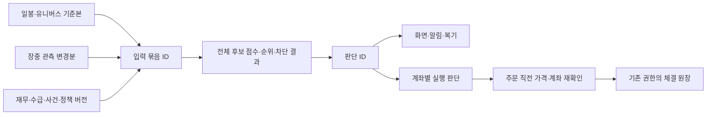

# 시그널 판단 입력 동결과 재생 설계

작성: 2026-10-07 · 기준: `main@5fc8832` · 대상: 가격 설계의 P2와 2.0 V20-02

## 왜 필요한가

현재 장중 가격은 저장된 일봉 배열 끝에 잠정값 한 개를 붙여 엔진에 들어간다. #585는 봇의 체결 참조 가격에 관측 ID와 기준 거래일을 남겼지만, 그 ID를 가격 배열을 만든 **뒤에** 다시 읽었다. 두 시점 사이에 새 시세가 도착하면 가격과 ID가 어긋날 수 있다. 이번 첫 코드 변경은 가격 배열과 관측을 같은 스냅샷에서 꺼내 이 틈을 닫는다.

이것만으로 전체 시그널을 재생할 수 있는 것은 아니다. 다음 세 경계가 남는다.

1. 국내 봇의 국면·엔진·진입 게이트 가격은 이제 한 번 캡처해 전달한다. 그러나 거시·재무·수급·공매도 입력을 차례로 읽는 동안 수집이 끝나면 다른 자료 세대가 섞일 수 있다.
2. `execution_gate.apply_from_store`는 엔진 점수를 계산한 뒤 가격·날짜·시그널 이력·공식 사건을 다시 읽었다. 국내 봇의 가격·날짜는 같은 묶음을 전달하도록 고쳤지만, 화면과 미국 경로 및 이력·사건의 별도 재조회는 남는다. 따라서 같은 점수라도 매수 차단의 입력 시각이 다를 수 있다.
3. 미국 봇은 새 가격 배열과 캐시된 `api._us_signals()`를 별도로 가져왔다. 이제 캐시가 점수·유니버스·가격·원본 날짜·장중 관측을 한 객체에 묶고 봇이 그 묶음만 사용한다. 다만 캐시가 유효한 시간과 주문 직전 시세 자격은 이 변경만으로 보증되지 않는다.

목표는 **그 시각에 실제로 계산한 전체 후보의 입력과 출력**을 다시 읽어 같은 결과를 얻고, 그 결과를 특정 페이퍼 판단과 체결에 연결하는 것이다. 이 작업은 기존 등록 가설의 점수·가중치·분위·평가 표본이나 주문 기준을 조정하지 않는다.

## 판단 하나의 경계

공용 `SignalBatch`는 한 시장의 한 계산에서 사용한 유니버스 전체와 정책을 담는다. 계좌별 보유·현금·한도는 별도 `ExecutionDecision`이 참조한다. 보유 종목 하나의 1분 현재가 수집은 새 공용 순위 판단으로 세지 않는다. 사용자가 목록을 새로고침하거나 SSE를 다시 연결한 것도 새 판단이 아니다.

`D`와 `E`는 공용 기록이다. `H`와 `J`는 계좌별 권한 안에 둔다. 화면 조회가 `I`를 호출하지 않는다. 연구 전용 출력이나 렌즈 스냅샷의 ID를 주문 판단 ID로 재사용하지 않는다.

## 불변 기록 계약

| 기록 | 반드시 보존할 값 | ID와 변경 규칙 |
|---|---|---|
| `PriceBase` | 시장, 각 종목의 날짜·가격 배열, 원본 파일 세대와 조정가격 규약, 결측·불일치 | 내용 SHA-256. 일봉 정정은 기존 값을 덮지 않고 새 ID |
| `QuoteDelta` | 기준본 ID, 덧붙인 종목별 가격·관측 ID·서버 수신시각·공급자 시각과 검증 여부 | 내용 SHA-256. 같은 가격의 새 관측도 다른 ID 가능 |
| `FactorInput` | 유니버스 전체, 재무, 수급, 공매도, 미국 시총·퀄리티·실적예정, 공식 사건·시그널 이력, 각 원천의 버전·가용 시각 | 종류별 내용 SHA-256. 늦은 수정은 새 버전 |
| `SignalBatch` | 위 입력 ID, 엔진에 전달된 정확한 설정과 `today`, unavailable 팩터, 국면 입력, 계산 시작·완료 시각, 코드·정책 버전, 전체 후보의 누락 사유 | 내용 ID에는 입력·계산 버전 사용. 계산 시각은 별도 첫 관측 기록 |
| `SignalDecision` | batch ID, 전체 후보의 점수·성분·커버리지·순위·kind·게이트·사건 판단, 대상 종목과 기권 이유 | `batch ID + 종목 + 출력 단계`의 결정적 ID. 결과 불일치 시 덮지 않고 중단 |
| `ExecutionDecision` | 공용 판단 ID, 사용자/포지션 참조, 현금·보유·위험 정책 버전, 사용한 가격 관측과 실제 체결 이벤트 키 | 계좌별 별도 ID와 접근 권한. 개인정보는 공용 원장에 미기록 |

엔진이 평가에서 제외한 종목도 원래 유니버스와 `가격 없음` 등의 이유로 남긴다. 모든 출력 행은 같은 시장·batch ID에 묶고, 종목 수를 나중에 줄여 상위 3% 분모를 다시 계산하지 않는다. `SignalResult`의 값뿐 아니라 실제 `engine.evaluate` 인자와 후처리 `execution_gate`의 입력을 보존해야 재생이라고 부를 수 있다.

ID용 JSON은 키·종목 순서·숫자·날짜·null 표현을 고정한다. `NaN`·무한대는 저장 전에 거절한다. 같은 ID의 다른 바이트가 나오면 해시 충돌 또는 직렬화 오류로 취급하고 기록을 덮지 않는다. `observed_at`만 달라 같은 내용을 계속 복제하지 않게 하고, 최초 관측시각과 이후 사용시각은 별도 열로 둔다. 원천 이용조건이 원문 장기 보존을 허용하지 않으면 허용된 수치·참조만 저장하고 그 batch의 재생 범위를 `partial`로 표시한다.

현재 가격 파일의 오래된 행에는 공개/확정 시각이 없다. 최초 포착한 과거 가격을 과거 당시 알 수 있었던 값이라고 선언하지 않는다. 최초 기준본의 역사 구간과 공급자 시각 미검증 장중 관측은 `strict_pit_eligible=false`로 남긴다. 미국 2026-09-25 구성 공백이나 국내 가격 구멍도 이 기록을 만들면서 메우지 않는다.

## 계산 경계 수정 순서

1. **가격 참조 원자화:** 원본 일봉의 같은 캐시 세대와 장중 quote 스냅샷을 한 번 잡고 그 스냅샷으로 잠정봉을 만든다. 체결 근거는 같은 quote 객체에서 가져온다. 이번 PR의 코드 범위다.
2. **읽기 전용 입력 캡처:** 국내·미국 각각 실제 `evaluate` 인자와 게이트 입력을 캡처하는 모듈을 추가한다. 우선 기존 출력과 나란히 비교하고, 입력 일부의 버전·가용시각이 없으면 그대로 `unverified`로 기록한다. 화면 조회마다 원본을 다시 저장하지 않는다.
3. **한 batch로 계산:** 국내 봇 국면·엔진·게이트의 가격·날짜를 같은 캡처에서 전달한다. 미국 API 캐시도 점수와 계산에 사용한 가격·날짜·관측을 같은 객체에 묶어 봇에 전달한다. 다음에는 양 시장의 거시·팩터·이력·사건을 같은 캡처로 주입하고, 입력 ID를 영속 보존한다. 캐시의 시간상 신선도와 주문 직전 가격 재확인은 P3에서 별도로 닫는다.
4. **선행 결정 ID:** 후보 선정과 기권 전에 batch·출력 기록을 영속 저장한다. 페이퍼 판단·체결 이벤트에 ID를 붙이고, 장애로 저장에 실패하면 `복기 불가`를 명시한다. 기존 실주문 경로에 필수 게이트로 연결하는 일은 재생·장애 시험 뒤 별도 전환으로 다룬다.
5. **오프라인 재생:** 주문 자격증명 없이 저장된 입력으로 엔진과 게이트를 재실행하고 전체 행의 점수·순위·kind·차단 이유를 비교한다. 처음에는 read-only 보고서이며 가중치 조정이나 연구 look을 실행하지 않는다.

## 저장량과 성능

현재 로컬 캐시 파일은 국내 일봉 약 2.6 MiB, 미국 일봉 약 4.9 MiB다. 이는 **로컬 파일 크기 예시**이지 Railway 사용량이나 추가 청구액이 아니다. 이 파일을 1분마다 복사하면 작은 유니버스에서도 저장량이 빠르게 늘어난다.

내용 주소·압축·중복 제거와 종류별 저장 바이트를 측정할 공용 원장 기반을 마련했다. 아직 라이브 계산 경로에서 전량 적재하지 않는다. 입력별 기준본/변경분 분리와 운영 증가량을 확인하기 전에는 이 기반만으로 `재생 가능`이라고 표시하거나 P2 완료로 세지 않는다.

가격 분해·복원 함수는 원본 날짜와 같은 길이의 일봉 기준본, 실제 적용된 관측 ID의 잠정봉을 별도 내용 ID로 만든다. 관측과 맞지 않는 날짜 없는 가격은 `unclassified`에 남겨 수치는 되살리되 출처는 `partial`로 둔다. `structure_status=verified`는 **배열 분해가 일치한다는 뜻만** 있으며, 오래된 일봉의 공개시각이나 공급자 시각이 인증됐다는 뜻이 아니다. 자동 적재·사용자 화면의 재생 가능 표시·실주문 연동은 아직 열지 않는다.

명시 호출용 오프라인 경로는 가격 ID에 엔진 인자·게이트 인자·전체 후보 출력을 연결한다. 저장된 값으로 전체 횡단면과 게이트를 다시 계산해 행별 불일치를 보고하며, 다른 시장 ID·없는 날짜·비유한 입력을 거부한다. `replay_attemptable`은 기록 형식이 갖춰졌다는 뜻일 뿐 **재생 일치 결과가 아니다**. 실제 운영 계산에서 이 인자들을 누락 없이 캡처하고 배포 뒤 같은 ID를 읽어 일치시키기 전에는 P2 완료로 세지 않는다.

- 일봉 기준본은 내용 해시로 공유한다. 새 거래일 봉과 정정된 봉은 기준본의 변경분으로 기록하고, 재생 가능한 체크포인트를 주기적으로 만든다. 기준본과 변경분의 참조는 보존해 과거 정정 전 값을 읽을 수 있게 한다.
- 장중에는 전체 253개 이상 일봉을 복사하지 않고 기준본 ID와 실제 붙인 quote 관측 목록을 남긴다. 보유 1분 수집과 공용 후보 재계산을 별도 사건으로 센다.
- 전체 후보 출력은 계산 batch당 한 번 압축·중복 제거한다. 사용자별 계좌 기록은 batch ID만 참조한다. UI 조회나 SSE 재접속은 별도 복사본을 만들지 않는다.
- 저장 오류를 조용히 삼켜 `재생 가능`으로 표시하지 않는다. 기존 180일 장중 시세 정리는 참조된 원본을 지울 수 있으므로, 결정을 참조하는 관측의 보존/이관 계약과 복구 시험 전에는 TTL을 줄이지 않는다.
- 첫 운영 표본에서는 압축 전후 바이트, 일봉 변경량, quote 변경량, batch당 CPU/쓰기 지연 p95, 중복 제거율, DB·WAL·볼륨 증가량을 시장별로 측정한다. 저장 여유와 실제 증가량을 보고 체크포인트 주기·보존 예산을 확정한다. 측정 전 임의의 저장 한도로 판단을 선택적으로 누락시키지 않는다.

## 인수 시험과 완료 조건

- 가격 배열을 잡은 직후 새 quote가 들어와도 참조 가격과 관측 ID가 같은 세대로 남는다. stale quote는 잠정봉에도 체결 근거에도 들어가지 않는다.
- 계산 중 재무·사건·가격 파일이 바뀌어도 이미 동결한 batch의 재생 결과가 바뀌지 않는다. 정정은 새 ID와 이전 ID 참조를 만든다.
- 미국 캐시 시그널의 가격 세대와 봇 실행 가격 세대가 다르면 이를 감지하고 같은 판단이라고 표시하지 않는다.
- 전체 유니버스·결측·게이트 전후 kind와 순위가 저장되고, 재시작과 재배포 후 같은 ID로 읽고 같은 출력을 얻는다. 같은 입력의 재시도는 행 수를 늘리지 않는다.
- 판단·실행 원장의 참조가 누락됐을 때도 수익률 0이나 정상 판단으로 바꾸지 않는다. 계좌별 자료는 다른 사용자에게 노출되지 않는다.
- 국내·미국 각각 최소 5개 완료 세션에서 저장량과 재생 성공을 확인한다. 이 운영 검증 전 P2를 완료로 세지 않는다. 새 ML 학습·등록 look·연구 전략의 라이브 승격은 이 단계에 포함하지 않는다.

현행 등록 헤드라인 `pit-8factor-rank3-hold5-final`의 99.15% 문턱, PIT 150, 실효 30, 퀄리티 가중치 0.15와 R11–R16 연구 잠금은 유지한다. 전체 2.0 데이터 확장 72%·3.0 10%·가격 P1–P6 완료 0/6은 운영 증거가 추가될 때만 갱신한다.
