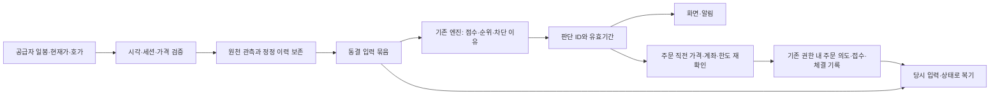

# Signal Desk 2.0 소규모 검증과 ML 확장을 위한 기반 설계

작성일: 2026-10-03 · 코드 확인 기준: `main@9e9d751`

2026-10-09 보강: [과거 데이터 기반 테스트 설계](HISTORICAL-ENGINE-EVALUATION-DESIGN-2026-10-09.md)를 연구 착수의 기준으로 추가했다. 보존 입력 재생·공개 이력 재구성·부분 연구의 범위를 구분하고, 역사 데이터 조사 → 엔진 재생 → 실패 분석 → 시간순 후보 비교/ML → 운영 차이 확인 순으로 진행한다. 운영 관측 대기는 과거 진단·개발의 선행 조건이 아니다. 기존 등록 실험의 문턱·표본·보호 구간은 유지한다. 이번 반영은 설계이며 신규 학습/실험 실행은 아니다.

이 문서는 사용자의 “작은 풀에서 출발점을 검증하고, 이후 데이터 확대와 ML 학습을 고려한다”는 방향을 구체화한 **설계안**이다. 후속 요청으로 구현을 시작했으며 첫 단계인 한정 가격 공백 재조회부터 진행한다. 새 ML 학습·가설 실행은 이 설계의 구현 단계에 포함하지 않는다. 상위 문서는 [2.0 로드맵](SIGNAL-DESK-2.0-ROADMAP-2026-10-03.md)이다.

핵심 결정은 **현재 엔진 옆에 재현 가능한 판단 기록을 만들고, 나중에 그 기록을 동일한 규약의 학습 데이터로 사용하는 것**이다. 현재 엔진이 좋은 성적을 낼 때까지 조정한 뒤 데이터만 늘리는 방식으로 접근하지 않는다. 데이터 확대, 모델 변경, 주문 정책 변경은 서로 다른 검증 대상으로 다룬다.

## 작은 풀에서 먼저 확인할 것

“작은 풀”은 새로 성적이 좋은 종목만 골라 구성하는 소수 종목집이 아니라 **현재 추적 중인 제한된 유니버스와 기존 PIT 구성 이력**을 뜻하는 것으로 설계한다. 이번 설계로 운영 유니버스를 축소·교체·고정하지 않는다. 기존의 정상적인 구성 변경도 당시 규칙과 시점대로 기록한다.

주된 설계 검증은 국내 자료로 시작하고, 미국 운영과 전진 관측은 기존대로 유지한다. 미국을 국내와 합쳐 표본 수를 채우거나 과거 구성 공백을 복원하지 않는다. 관심종목을 개별 추가하는 제품 기능과 연구 유니버스 편입도 구분한다.

| 작은 풀에서 확인 가능한 것 | 작은 풀만으로 확정할 수 없는 것 |
|---|---|
| 같은 입력과 버전으로 같은 결론을 재현하는가 | 다른 시장과 종목 규모에서도 같은 수익이 나는가 |
| 판단 당시에 실제로 알 수 있던 자료만 쓰는가 | 아직 겪지 않은 장세에서도 우위가 있는가 |
| 후보·기권·주문·청산의 이유가 연결되는가 | 더 많은 데이터가 현재 가설의 약점을 해결하는가 |
| 미래 학습에 필요한 기록을 빠짐없이 쌓을 수 있는가 | 종목 수를 늘리면 독립적인 검증 기간이 늘어나는가 |
| 기존 등록 조건이 충족됐을 때 우위가 관측되는가 | 소규모 검증 통과만으로 라이브 주문을 허용해도 되는가 |

가령 200종목을 60세션 기록한 12,000행은 12,000회의 독립 실험이 아니다. 같은 날의 시장 충격과 겹치는 미래 수익 구간을 공유한다. 이는 단위 설명용 예시이며 현재 운영 표본을 재산정한 값이 아니다.

## 유지할 검증 경계

- 기존 등록 헤드라인 `pit-8factor-rank3-hold5-final`, 가중치·분위·손절·팩터를 유지한다. 퀄리티 가중치 0.15를 변경하지 않는다.
- 실효 30·PIT 150·등록 문턱 99.15%·최악 위상 조건과 기존 look 수를 건드리지 않는다. 이 기준은 현재 등록 가설의 기준이며 모든 미래 ML의 충분 표본 기준으로 일반화하지 않는다.
- 2026-10-13 마감 전 interim 실행 금지, 기존 `prereg.run_due` 유지. interim 통과도 가중 게이트를 열지 않는다. 2027-02-12는 요건 충족을 전제로 한 일정이지 자동 완료일이 아니다.
- `판정 불가` 동안 가중 게이트는 닫힌다. 잠긴 `판별력 없음`도 정직한 검증 완료다. 기존 다섯 관문과 59/100을 새로운 개발 체크리스트로 대체하지 않는다.
- R11–R16의 비중첩 h20 12블록을 유지하고 라이브 승격·모의투자 화면의 연구 수익 공개를 하지 않는다. 새 ML 설계도 이 게이트의 우회로가 아니다.
- 가격 보간·5년 full_prices 백필·012510 제외·미국 09-25 구성 되메우기·추격매수 활성화를 하지 않는다. 제안된 비매수 급등 shadow도 시작하지 않는다.
- 숏폼·온보딩·D7·외부 성장 동결을 유지한다. 실제 코드와 설정은 후속 구현 요청 후 변경한다.

## 성공을 세 종류로 분리

| 구분 | 질문 | 확인 방법 | 통과가 뜻하지 않는 것 |
|---|---|---|---|
| 시스템 신뢰 | 무엇을 보고 왜 판단했는지 재현되는가 | 시점·출처·버전·상태 감사와 회귀시험 | 수익 우위 |
| 투자 가설 | 같은 조건의 대조보다 정말 나은가 | 기존 등록 평가와 해당 가설의 관측 요건 | 다른 시장·모델·주문 정책으로의 일반화 |
| 사용자 가치 | 사용자가 시장과 자신의 판단을 더 잘 이해하는가 | 이유·반증·기권·다음 확인을 설명하는 과업 평가 | 거래 증가나 수익 보장 |

따라서 초기 수익이 좋지 않아도 시스템 신뢰와 기록 기반을 완성하는 작업은 유효하다. 반대로 기록이 정교해졌다는 이유로 예측력을 인정하지 않는다.

## 전체 구조와 책임

구조의 중심은 `원천 자료 → 당시 입력 묶음 → 판단 기록 → 실행 기록 또는 기권 → 성숙한 결과`다. 제품 설명과 미래 연구는 같은 입력 묶음을 참조하지만, 서로의 상태를 수정하지 않는다.

| 계층 | 역할 | 재사용할 자산 | 새로 정의할 경계 |
|---|---|---|---|
| 수집과 시점 검증 | 자료의 출처·공개시각·수집시각·결측 확인 | store, market_clock, PIT 유니버스, KB 원천 | 수정 데이터와 당시 관측 버전 분리 |
| 입력 묶음 | 당시 전체 모집단과 특성값을 불변 버전으로 보존 | 시그널 이력, 팩터 계산, 기존 shadow snapshot | 재현 가능한 입력 묶음 ID와 품질 상태 |
| 판단 | 현행 점수·후보 선정·기권·개인 제약 결과 기록 | engine, lenses, portfolio_decision | 점수·선정·위험·사용자 맥락을 구분한 참조 |
| 실행 | 실제 수량·평균가·위험 상태·체결 이벤트 기록 | execution_events, intraday_quotes, execution_audit | 시간순 상태 복원과 판단 ID 연결 |
| 결과 | 규약에 따른 성숙·누락·정정 상태 관리 | accuracy, prereg, 기존 forward mark, meta_entry | 라벨 규약과 품질 범위 식별 |
| 제품 설명 | 같은 근거를 시장 읽기·관심종목·복기에 사용 | why_now, daily_change, hypothesis, KB | LLM 문장을 계산값이나 확률로 바꾸지 않음 |
| 연구 | 입력과 결과의 승인된 버전으로 학습·평가 | 기존 연구 모듈과 artifact 관례 | 고정 dataset manifest와 후보 모델 기록 |

물리적으로 일곱 서비스를 만들자는 뜻은 아니다. 초기에는 현재 애플리케이션 안의 모듈과 저장소 경계로 구현한다. 연구 프로세스는 운영 주문 자격증명과 쓰기 권한 없이 고정 artifact를 읽도록 설계한다. 새 ML 출력에서 라이브 주문으로 연결되는 경로는 만들지 않는다.

## 기록 계약

아래는 논리적 데이터 계약이다. 같은 정보를 가진 기존 테이블을 재사용하며, 모두 새 테이블로 중복 생성하지 않는다. 실제 마이그레이션과 API 이름은 구현 단계에서 정한다.

| 기록 | 필수 정보 | 보존 원칙 |
|---|---|---|
| 유니버스 버전 | 시장, 세션, 구성 규칙 버전, 종목 식별자, 편입·편출, 원천 관측시각 | 현재 구성을 과거에 소급하지 않음 |
| 원천 근거 버전 | source ID, 내용 hash, 공개시각, 최초 관측시각, 대상 기간, 시간 신뢰도, 대체 전 버전 | 재인용 출처를 독립 증거로 중복 계산하지 않음 |
| 특성값 묶음 | 시장·종목·세션·판단 기준시각, 입력 참조, 계산 버전, 값·단위·결측·freshness | 종합점수뿐 아니라 개별 성분과 커버리지도 저장 |
| 판단 기록 | decision ID, 입력 묶음 ID, 엔진·정책 버전, 순위, 후보 여부, 차단·기권 이유 | 사용자 설명과 당시 판단을 같은 ID로 연결 |
| 포지션 이벤트 | decision 참조, 수량·평균가·최고가·유효 risk, 의도·전송·체결 시각, 비용 범위 | ADD·부분청산·설정 변화도 시간순 보존 |
| 결과 기록 | 대상 snapshot, label spec, 진입·종료 관례, 성숙시각, 결과 상태, 가격·비용 버전 | 미래 미성숙과 손실 0을 구분 |
| 데이터셋 명세 | 포함 범위, 입력·결과 버전, 코드 hash, 시간 분할, 제외 사유, 접근 권한, 내용 checksum | 같은 명세는 같은 행과 값으로 재생성 |
| 모델 후보 | 데이터셋 명세, 입력 목록, 학습 설정·시드, 전처리 버전, 평가 계획, artifact hash | 실험 결과가 현재 모델 포인터를 자동 변경하지 않음 |

종목 식별에는 시장과 안정적인 식별자를 사용한다. 종목 코드 변경·상장폐지·합병을 단순 문자열 삭제로 처리하지 않는다. 개인 보유·계좌·사용자 노트는 공용 학습 원장과 분리하며 사용자의 매매 수익을 정답으로 무단 혼합하지 않는다.

### 관찰 단위

기본 연구 패널은 **시장별 완료 세션의 지정 기준시각에 동결된 종목 한 개의 입력**이다. 정확한 기준시각은 구현 전에 기존 스냅샷 생성·지연 자료 정책과 함께 고정하며 결과를 보고 선택하지 않는다. 이 새로운 보존 기준이 기존 등록 하네스의 표본 선택 규칙을 변경해서는 안 된다.

- 장중 실제 판단은 각각의 decision event로 보존하지만, 새로고침마다 독립 학습 표본을 늘리지 않는다.
- 같은 세션의 여러 후보는 같은 날짜 그룹에 둔다. 재발행된 동일 원문은 source group으로 연결한다.
- 같은 입력이 재처리되면 같은 논리 ID로 중복을 막는다. 다른 데이터 정정은 새 버전으로 연결한다.
- 전체 유니버스에는 정상 후보·비후보·차단·자료 부족 행을 모두 남긴다. 품질 미달 행을 학습할지는 별도 inclusion rule로 정하고, 행과 제외 사유 자체는 삭제하지 않는다.

**전체 관찰 대상 기록과 전체 대상의 새 전략 채점은 다르다.** 이 설계는 비매수 급등 shadow를 승인하지 않는다. 전체 풀용 새 라벨 생성·비교 실험은 후속 연구 계획과 요청이 있을 때만 가동한다.

### 당시 알 수 있던 정보

대상 분기나 가격 날짜가 오래됐다는 이유로 당시 입수 가능했던 자료로 보지 않는다. 엄격한 전진 관측에서는 원천 공개시각뿐 아니라 시스템 최초 관측·가공 완료가 판단 시각 이전인지 확인한다. 단순히 날짜만 기록된 과거 자료는 장중 가용성을 증명하지 못한다.

예를 들어 10월 5일 장 마감 뒤 공개된 자료를 10월 6일 아침 수집했다면, 10월 5일 마감 판단에 넣지 않는다. 나중에 입수한 과거 공시는 탐색용 별도 버전일 수 있지만 당시 운영 snapshot을 덮어쓰지 않는다. 이는 예시이며 실제 데이터 수집을 실행한 것이 아니다.

가격 정정은 `당시 관측값`과 `나중에 정정된 값`을 함께 보존한다. 미래 기업행사로 재조정된 가격계열을 과거 입력에 무심코 덮지 않는다. 원시 가격·조정 규약·기업행사 버전을 구분하고, 안전하게 재현할 수 없으면 해당 feature/label을 미확인으로 둔다. 가격 구멍은 보간하지 않는다.

### 종목 KB의 현재 근거 계약 (2026-10-04 보강)

KB에 자료가 **저장돼 있다**는 것과 **지금 판단에 쓸 수 있다**는 것은 다르다. 종목별 요약에는 원문 발행시각(`newest_ts`), 요약 생성시각(`updated`), 마지막 원천 확인 결과를 분리한다. `updated`가 오늘이어도 원문이 지난주 것이면 현재 소식이 아니다. 수집 요청 실패도 `새 기사 없음`이 아니다.

- 종목별 현재 요약·봇 자문·종목 상세·LLM 해설은 공통 신선도 판정만 사용한다. 원문 발행시각 불명, 미래 날짜, 72시간 초과, 마지막 종목 수집 실패는 **현재 근거에서 제외**한다. 예전 요약과 원문은 삭제하지 않고 날짜가 드러나는 관리 기록으로만 보존한다.
- 요약 생성 입력도 개별 원문마다 72시간을 검사한다. 최신 기사 한 건이 함께 들어온 오래된 기사를 최신 요약으로 세탁하지 않게 한다. 일반 뉴스 후보는 날짜가 확인된 72시간 이내라도 Decision 자격이 없다. 별도로 확인된 공식 DART 이벤트의 기존 만료·차단 계약은 바꾸지 않는다.
- 마지막 성공한 검색에 새 기사가 없다면 `새로 확인된 소식 없음`이지 `지난 호재 유지`가 아니다. 원천 요청 실패는 종목별 실패로 기록하고 즉시 현재 요약을 격리한다. 시그널의 잠긴 가중치·매매 문턱을 대신 변경하거나, KB가 없다는 이유만으로 수익 우위를 주장하지 않는다.
- 사용자에게 보이는 원문 발표시각과 관리자에게 보이는 요약 갱신시각을 구분한다. API가 현재 KB를 주지 않을 때는 `확인 불가`를 보여주고, 과거 문장과 심리 점수를 현재 점수 옆에 붙이지 않는다.
- 배포 전 생성된 다이제스트는 최신 원문이 포함돼 있어도 구 입력 범위로 만들었을 수 있다. 정책 버전이 없는 요약은 현재 근거에서 격리하고, 다음 성공적 수집에서 같은 URL이라도 한 번 새 계약으로 다시 요약한다. 수집이 꺼져 있거나 실패하면 격리를 유지한다.

이 계약은 **검색 성공이 모든 최신 뉴스를 빠짐없이 찾았다는 보증은 아니다.** 자동 KB 수집은 기존 비용·효용 잠금에 따라 기본 OFF이며, OFF인 날은 마지막 원문이 만료되면 현재 KB가 비게 된다. 상시 커버리지를 주장하려면 시장별 수집 주기·예산·원천 성공률·종목별 지연을 운영에서 별도 검증해야 한다.

2026-10-04부터 종목 검색 기사에는 `issuer-role-v1` 귀속 게이트를 적용한다. 제목 선두의 정확한 회사명, 안전한 원문 URL을 요구한다. 계약·수주 기사는 공급자/구매자 역할을 구분할 수 없으면 거절하고, 매출 대비 비율에는 해당 회사가 분모로 명시돼야 한다. DART 응답의 `corp_code`도 요청 회사와 대조한다. 이전 뉴스 원문과 구버전 다이제스트는 보존하되 새 검증 없이 현재 설명에 재사용하지 않는다. 일반 뉴스는 출처가 있는 설명·학습 자료이고 감성이나 뉴스 후보 이벤트만으로 매수·매도를 바꾸지 않는다. 검증된 공식 공시의 기존 위험 이벤트 경로만 Decision에 남는다. 관심종목 탭은 최신 근거·원문·확인 시각·모르는 점을 짧게 보여주며 뉴스 부재를 안전하다는 뜻으로 바꾸지 않는다.

이 게이트는 **검색 결과 제목과 짧은 설명의 보수적 귀속 검사**이지 기사 전문 사실 검증이 아니다. 거짓 기사·검색 누락·동명이인·미국 기업 식별을 완전히 해결하지 못하므로 불명확하면 기권한다. 금호타이어/현대무벡스처럼 상대방의 계약 금액과 매출 분모를 옮겨 붙이는 오류를 줄이기 위한 안전장치이며, 등록 헤드라인 진행률이나 수익 검증 점수를 올리는 근거가 아니다.

## 결과와 학습 목표

### 서로 다른 정답을 섞지 않는다

| 결과 종류 | 답하는 질문 | 사용 경계 |
|---|---|---|
| 현재 등록 하네스 결과 | 등록된 상위 3%·h5 전략이 대조보다 나은가 | 현재 헤드라인 전용. 규약 변경 금지 |
| 종목 고정 지평 결과 | 당시 자료로 본 종목의 이후 가격 흐름은 어땠는가 | 미래 종목선정 ML의 후보 라벨. 신규 규약은 별도 승인 |
| 실제 매매 결과 | 그 계좌·수량·진입·청산·비용에서 무엇이 발생했는가 | 실행·배분 감사. 종목 자체의 예측 정답과 동일시하지 않음 |
| 기존 meta_entry 결과 | 기존 매수 후보 중 어떤 조건의 진입을 기권할지 연구 | 현재 h20 triple barrier 규약의 별도 결과 |
| 설명 품질 결과 | 주장·원문·반증·수치가 정확한가 | LLM 품질 평가. 주가 상승 여부로 사실 정확성을 채점하지 않음 |

`meta_entry.py`는 현재 매수 후보 중심의 라벨을 만든다. 따라서 이것만 확대하면 “기존 후보 중 무엇을 거를까”를 배울 수는 있어도 “전체 풀에서 무엇을 발견할까”의 대표 데이터가 되지는 않는다. 후보 필터 모델과 전체 풀 순위 모델을 별도 task로 둔다.

결과 상태는 적어도 `대기 / 성숙 / 가격 공백 / 거래정지·기업행사 확인 필요 / 정정 검토 / 규약상 제외`를 구별한다. 상장폐지나 거래정지 때문에 관측이 끊긴 종목을 조용히 제거하지 않는다. 확정 가능한 처리 규약이 없으면 결과와 커버리지에 남기고 해당 평가의 제한으로 보고한다.

### 첫 ML 연구의 제안

ML 시작 요청을 받았을 때 첫 질문은 **“동일한 입력 범위에서 현재 점수보다 향후 5거래일의 상대적인 가격 흐름을 더 잘 정렬할 수 있는가”**로 제한하는 것을 제안한다. h5는 현재 등록 연구와 질문을 비교하기 위한 선택이며 수익이 좋았던 지평을 탐색한 결과가 아니다.

이는 현재 하네스의 새 look이 아니다. 진입·종료 가격, 기준선, 비용 반영, 모집단, 효과 크기, 분할, 평가 일정은 별도 연구 계획에서 먼저 확정한다. 종목별 상대가격 결과와 포트폴리오 비용 후 성과도 구분한다. 입력 데이터가 준비됐다는 이유만으로 라벨 작업이나 학습을 시작하지 않는다.

모델 순서는 기존 점수 대조 → 규제가 있는 단순 선형 모델 → 필요할 때만 작은 트리 모델이다. 첫 모델부터 딥러닝·강화학습·수백 개 팩터·임베딩 원문을 한꺼번에 넣지 않는다. 현재 엔진 가중치는 그대로 두며 새 모델 계수는 별도 연구 artifact에만 존재한다.

종목별 개별 모델 대신 제한된 공통 특성으로 시장별 모델을 먼저 검토한다. 종목 이름을 외우는 효과를 피하고, 종목별 적은 기간을 더 잘게 쪼개지 않기 위해서다. 국내와 미국의 공통 모델·전이학습은 별도 후속 가설로 둔다.

## 검증 설계

### 시간과 모집단 분리

1. 시간순으로 개발·검증·최종 시험 구간을 구분한다. 종목 행을 무작위로 섞어 80 대 20으로 나누지 않는다.
2. 같은 시장 세션의 종목들은 같은 구간에 둔다. 학습 라벨의 미래 수익 구간이 검증 구간과 겹치면 학습에서 제거한다. 학습 시점에 라벨이 실제로 성숙·수집됐는지도 확인한다.
3. 구간 간 간격은 라벨의 종료와 정보 가용성에 근거해 사전에 정한다. 기존 `meta_entry.purged_folds`를 참고하되 특정 embargo 값을 모든 과제에 복사하지 않는다.
4. 정규화·특성 선택·결측 처리에 필요한 통계는 학습 구간에서만 구한다. 가격 보간 금지는 유지한다. 비가격 특성의 결측 처리도 마스크와 처리 버전을 기록한다.
5. 검증 결과로 모델을 선택한 뒤 최종 시험 구간은 고정된 일정에만 평가한다. 이미 본 시험 결과를 새 모델의 미관측 성과라고 부르지 않는다. 반복 실험 수와 열람 이력을 기록한다.
6. 날짜 블록 단위 불확실성을 고려하고, 업종·시기 집중과 거래 참여 범위를 함께 보고한다. 대조는 같은 모집단·날짜·체결 관례·위험예산·비용을 사용한다.

시계열의 무작위 분할 문제와 전처리 누수는 [scikit-learn 교차검증 문서](https://scikit-learn.org/stable/modules/cross_validation.html#cross-validation-of-time-series-data) 및 [데이터 누수 문서](https://scikit-learn.org/stable/common_pitfalls.html#data-leakage)를 따른다. 금융 라벨의 중첩 제거·시장별 세션 묶음은 이 프로젝트에서 추가로 명시하는 설계다. `TimeSeriesSplit` 하나가 모든 중첩과 공개시각 문제를 해결한다고 가정하지 않는다.

### 모델을 평가할 질문

- 정보 순위가 개선되는가: 날짜별 순위 지표와 그 불확실성. 이것만으로 승격하지 않는다.
- 같은 제약에서 비용 후 의사결정이 개선되는가: 등록한 경제적 목표와 기준선, 거래 참여 범위, 회전·집중·낙폭을 함께 확인한다.
- 한 업종이나 짧은 상승 구간에만 의존하는가: 사전 정의한 구간 진단을 사용하며 사후로 유리한 구간만 골라 발표하지 않는다.
- 예측확률을 표시하려는가: 별도 calibration 자료와 검증이 필요하다. 순위 점수를 확률처럼 표시하지 않는다. 보정과 모델 학습에 같은 관측을 무비판적으로 재사용하지 않는다. [확률 보정 문서](https://scikit-learn.org/stable/modules/calibration.html)
- 자료가 부족한 환경에서 기권하는가: 범위 밖·결측·오래된 입력을 조용히 정상 점수로 내보내지 않는다.

LLM이 나중에 추출한 과거 문서 특성은 생성 시각·모델·프롬프트·근거를 기록하고 사후 재구성으로 구분한다. 원문 날짜를 과거로 제한하는 것만으로 사전학습 지식 유입이 제거됐다고 주장하지 않는다. 초기 ML 비교에서는 이런 특성을 분리하고 전진 수집된 증거로 별도 평가한다.

## 언제 데이터를 넓히고 ML을 시작할까

단일 “몇 행 이상” 버튼 대신 세 결정을 따로 둔다. 아래 조건은 미래 구현과 연구를 위한 제안이며 기존 등록 문턱을 대체하지 않는다.

| 결정 | 선행 조건 | 허용되는 다음 단계 |
|---|---|---|
| 데이터 수집 범위 확대 | 기존 범위의 누락·시점·식별·재현 문제 파악, 수집 비용 측정, 새 범위의 구성 규칙·라이선스 확인 | 별도 버전의 확장 모집단을 전진 기록 |
| ML 연구 착수 | 학습 가능한 성숙 라벨과 기간 확인, 시간 분할 가능, 데이터셋 재현, 검출할 최소 효과·예산·실험 수 사전 결정 | 권한 분리된 오프라인 학습과 별도 등록 전진 평가 |
| 운영 적용 검토 | 해당 후보의 미관측 검증과 비용 후 평가, 범위·위험·실행 검증, 승인·복구 계획 | 별도 승인된 제한적 적용 검토. 자동 승격 없음 |

기존 `scaling_readiness.py`의 시장별 100개 결과는 준비 진단의 한 항목일 뿐, 충분한 독립 표본이나 모델 신뢰도를 뜻하지 않는다. ML 최소 표본 수를 지금 100·1,000·10,000 중 하나로 임의 확정하지 않는다. 연구 착수 전 사용할 기간·중첩·변동성·검출할 최소 효과를 바탕으로 관측 계획을 만든다. 그 분석도 기존 잠긴 가설의 문턱을 바꾸는 수단으로 쓰지 않는다.

현재 엔진의 판별력이 없어도 원장 품질이 충분하면 별도 ML 가설을 연구할 수 있다. 그러나 기존 실패를 숨기거나 기존 gate를 우회할 수는 없다. 반대로 현재 엔진이 통과해도 새 시장·새 모델이 통과한 것은 아니다.

확장은 종목 수, 시장, 자료 종류, 모델 복잡도 중 **한 축씩** 진행한다. 예를 들어 현재 모집단은 원래 규칙대로 보존하면서 새 종목군을 별도 버전으로 추가하고, 기존 범위와 확장 범위의 결과를 따로 보고한다. 미국 2026-09-25 같은 과거 구성 공백은 새 수집으로 사라진 것처럼 처리하지 않는다.

## 저장과 비용

초기에는 SQLite에 참조·상태·이벤트·작업 이력을 두고, 큰 불변 입력 묶음은 Parquet artifact로 보관하는 방식을 제안한다. Qlib의 데이터·학습·평가 artifact 관리 방식을 참고하되 Qlib 자체로 이관하지 않는다. [Microsoft Qlib](https://github.com/microsoft/qlib)

- 입력 묶음은 준비 → 검증 → 공개 참조의 순서로 발행한다. 파일 작성과 DB 갱신이 하나의 원자적 트랜잭션이라고 가정하지 않는다. 먼저 artifact를 완성·검증한 뒤 DB에서 참조를 확정하고, 중단된 작업은 재시작 시 대사한다.
- 동일 ID 재처리의 중복을 막고 checksum이 맞지 않는 묶음은 격리한다. 부분 완료 묶음을 학습이나 설명에 사용하지 않는다.
- 일별 입력 패널과 실제 판단 이벤트를 분리해 매 틱마다 전체 풀을 복제하지 않는다. 보유·주문 감사에 필요한 관측은 별도 원장으로 유지한다.
- 원문 저장·외부 모델 전달·학습 이용 권한은 공급자 약관별로 확인한다. 허용되지 않은 원문을 무조건 장기 보관하지 않는다. 필요한 메타데이터와 허용된 근거 범위를 보존한다.
- 비용은 종목당 데이터 수집, 세션당 입력 보존, 변경 원문당 LLM 처리, 연구 실행당 CPU·메모리·시간으로 측정한다. 현재 확인하지 않은 청구액을 추정해 설계 근거로 쓰지 않는다.
- Milvus는 문서 검색, 학습 저장소는 시점별 수치 데이터라는 서로 다른 문제를 해결한다. 문서가 많아졌다는 이유만으로 가격 예측 ML에 벡터 DB가 필요한 것은 아니다.
- 별도 큐·스토리지는 실제 적체·쓰기 경합·artifact 크기·복구 시간을 측정한 뒤 확장한다. 지금 GPU나 분산 플랫폼은 도입하지 않는다.

## 사용자 화면으로 전달되는 정보

설명은 입력과 판단 기록을 읽는 계층이며 학습용 미래 결과를 현재 카드에 역으로 붙이지 않는다.

| 사용자에게 보일 내용 | 참조할 기록 | 표현 제한 |
|---|---|---|
| 왜 후보인가 | 당시 팩터·순위·선정 규칙 | 성공확률·보장수익으로 바꾸지 않음 |
| 왜 지금은 기다리는가 | 차단·기권·개인 제약 | 자료 없음과 부정적 증거 구분 |
| 무엇이 달라졌는가 | 이전과 현재의 근거·입력 버전 | 동시 발생을 원인이라고 단정하지 않음 |
| 무엇을 확인해야 하는가 | 관심종목 가정·반증·예정 사건 | 조건 충족을 자동 주문 허가로 취급하지 않음 |
| 지난 판단에서 무엇을 배웠는가 | 당시 기록과 이후 성숙한 관측 | 승자만 선택하거나 사후 설명으로 원기록 수정 금지 |

초기 화면에 새로운 ML 점수, 근거 없는 확률, 조기 연구 수익을 추가하지 않는다. 기존 등록 헤드라인을 유지한다. 이 기록 체계가 관심종목 노트와 판단 복기의 공통 기반이다.

## 보유 후 판단 계약 (설계 추가: 2026-10-04)

### 문제와 권한 경계

기존 종목 시그널은 **지금 새로 살 후보인가**에 가깝다. 상대 순위 `강력매수` 이후 가격이 하락해도 종합점수가 일반 `매도` 조건에 이르지 않으면 `HOLD`일 수 있다. 이것만으로 이미 산 사람에게 `유지`나 `추가매수`를 권했다고 해석해서는 안 된다. 반대로 손실만 보고 그날의 근거가 틀렸다고 사후 단정하지 않는다. 보유자 전용 판단은 기존 `engine`의 점수/가중치/문턱과 공개 신호, KB `Decision`의 확정 이벤트 규칙, 봇 위험·실주문 정책을 **수정하지 않는 읽기 모델**이다. 현재 KB의 `critical → exit`, `serious → trim`은 기존 봇 결정의 의미로 유지하고, 새 카드의 `청산 검토`/`축소 검토`는 사용자에게 보여주는 판단이지 실계좌 실행 명령이 아니다.

계약의 대상은 실제로 보유 중이라고 확인된 포지션이다. 수동 등록·브로커 동기화·봇 모의보유를 출처별로 구분한다. 실계좌가 미연결이면 체결·평균가·수량을 검증했다고 말하지 않는다. 개인 자료는 계정별 접근 권한 안에 두고 공용 종목 점수나 미래 학습 라벨로 섞지 않는다. 보유 전 종목은 즐겨찾기나 상위 순위 여부와 무관하게 점검 대상에 포함하되, 원천 수집 예산/커버리지 부족으로 확인하지 못한 종목과 실패 원인을 명시한다. 공용 원천의 개별 보유자 정보 유출 없이 원문 추출 결과를 공유한다.

### 입력, 출력, 판정 순서

`HoldingVerdict`는 `position_ref/source`, `asof/valid_until`, `policy_version`, `input_snapshot_ids`, `price_freshness`, `position_freshness`, `event_source_status`, `cause_observation`, `action_review`, `supporting/contrary_evidence_ids`, `abstain_reason`, `next_check`, `notification_key`를 가진 불변 기록이다. 재계산 시 새 버전으로 연결하고 과거 카드의 당시 입력을 덮어쓰지 않는다. 가격 하락·회복·포지션 수량 변화를 세션을 넘어 추적한다. 고점이 종가만으로 관측됐다면 `종가 기준 고점`으로 적고 장중 고점인 척하지 않는다. 배당·분할·권리락 등 가격 비교를 왜곡할 수 있는 기업행사가 확인되지 않으면 해당 수익률 비교를 기권한다.

1. **자료 관문:** 시장별 최근 완료 세션/장중 허용 지연 기준으로 검증된 가격, 종목 식별자, 보유 원천, 평균가·수량, 이벤트 원천의 조회 성공/미조회/실패 상태를 검사한다. 가격 stale·결측·유니버스/기업행사 불명 또는 권한 부족이면 `자료 부족` + `판단 보류`로 종료한다. 실제 갱신 시도 실패가 확인되면 stale 갱신 실패 알림 경로를 사용한다. 평단이 수동 입력이면 개인 손익·평단 대비 하락 판단만 `미검증`으로 낮추고, 검증 가능한 종목 수준 사실은 분리해 표시한다. 평단·수량이 없으면 그 값에 의존하는 개인 행동 판단을 기권한다.
2. **하락 배경 관측:** 당시 관측 가능한 공시/실적/가이던스의 원문·공개시각·최초 수집시각·대상 법인을 검증한다. `confirmed + decision_eligible`인 부정적 기업 사건만 `확인된 기업 사건`으로 표시하며, 사건과 가격 하락의 **인과가 증명됐다고 표현하지 않는다**. 미확인 기사·LLM 요약은 원인 확정이 아니다. 사전에 정한 동일 시장·업종 기준과 해당 날짜의 수익률/거래량/수급을 나란히 보여줄 수 있지만 동행은 인과관계가 아니다. 조회 실패와 `조회 성공했으나 사건 미발견`을 구별하며, 둘 다 `단순 조정`의 증거가 아니다. 사건도 동행도 설명하지 못하면 `개별 약세·원인 미확인`이다.
3. **보유 행동 검토:** 검증된 중대 악재 또는 기존 포지션 위험 정책의 위반이 있으면 추가매수를 제외하고 `비중 축소 검토`/`청산 검토`와 그 **서로 다른 근거**를 보여준다. 위험 정책은 보유자의 사전 설정·유효시각이 확인될 때만 해석하고 봇의 손절값을 실계좌에 복사하지 않는다. 원인 미확인 하락은 기본 `판단 보류`와 조사 항목을 제시하며, 확인된 사전 보유 계획이 있을 때만 그 계획에 따른 `유지·관찰`을 설명한다. 가격이 싸졌다는 이유로 `추가매수 검토`를 만들지 않는다. 추가매수는 새로운 독립 진입 조건이 유효하고, 사전 정의된 추세 안정·부정적 사건 원천의 충분한 커버리지·개인 집중/현금/한도가 모두 허용될 때에만 **검토** 후보가 된다. 자료원 한 곳에 사건이 없다는 사실만으로 충분한 커버리지라 간주하지 않는다. 이것도 거래 권고의 입증이나 주문 허가가 아니다. 여러 근거가 충돌하면 상충 사실을 함께 보이고 안전 쪽으로 기권한다.

출력은 `cause_observation = confirmed_company_event | broad_market_or_sector_comove | unexplained_idiosyncratic_weakness | insufficient_evidence`와 `action_review = consider_add | monitor | consider_trim | consider_exit | abstain`의 **두 축**이다. `broad_market_or_sector_comove`는 선택한 비교군의 동반 움직임만 뜻하며 `기업 악재 없음`이나 `매수 기회`를 뜻하지 않는다. 행동 카드에는 기존 신규진입 시그널, 개인 보유 위험, 확인된 사실과 미확인 항목, 다음 확인 사건/시간, 근거 링크, 데이터 기준시각을 분리한다. `SELL` 신호가 없는데 축소 검토가 나와도 모순이 아니라 서로 다른 질문에 대한 답임을 설명한다.

### 알림·검증·구현 순서

알림은 확인된 중대 악재, 보유 위험 상태의 **전이**, 판단 중 핵심 가격의 stale 갱신 실패처럼 사용자 행동에 영향을 줄 수 있는 변화만 보낸다. `사용자/포지션/사건 또는 상태 전이/정책 버전`으로 중복을 막고 재시작·재계산·원문 재인용이 같은 알림을 늘리지 않게 한다. 낮은 심각도는 묶음/음소거를 허용한다. 알림에는 판단 근거와 기준시각, 모르는 것, 앱 카드 이동만 넣으며 텔레그램 명령으로 주문하지 않는다.

첫 구현은 **사실 카드와 기권**이다. V20-02의 포지션 시간순 원장, V20-04의 원문/시각/반증 계약, V20-06의 개인 권한·알림 중복 제어 뒤 V20-06b에서 읽기 전용 판정을 붙인다. 새로운 `추가매수/축소/청산 검토` 문구는 사전 정책·사례 시험을 잠그고 shadow로 전진 관찰하기 전에는 사용자에게 매매 권유처럼 노출하지 않는다. 그전에는 기존에 검증 가능한 사건·사용자 설정 위험의 사실과 `판단 보류/다음 확인`만 보여준다. `confirmed event`, 사건 미발견, 원천 실패, stale 가격, 종가만 있는 고점, 수동 평단, 시장/업종 동반 하락, 개별 원인 미확인, 상충 근거, 중복 알림, 실계좌 미연결을 모두 인수 사례에 넣는다. 카드 열기·렌즈 변경·알림 발생으로 기존 시그널, 봇, 실주문 상태가 변하지 않는 회귀시험이 필요하다.

투자 효과는 현대차 같은 한 손실 사례나 사후 발견한 뉴스로 기준을 정하지 않는다. 대상 모집단(신호 후 실제 보유와 같은 조건의 대조 포지션), 시장·보유 지평·비용·비교군·경고 정의·결측 처리·look 수를 **첫 평가 전에** 고정하고 전진 관측한다. 기업 악재 탐지의 정확도/오경보/경고 지연, 전체 보유의 coverage·기권율, 최대 불리한 가격 이동과 비용 포함 h5/h20 위험·수익을 분리한다. 중첩 기간·동일 사건의 다수 종목은 독립 표본으로 세지 않는다. 기존 등록 헤드라인이나 R11–R16의 첫 비중첩 h20 12블록을 이 평가로 대체하거나 앞당기지 않는다. 우위가 검증되고 별도 승인되기 전에는 행동 문구가 자동 주문·청산 정책으로 승격되지 않는다.

비용은 기존 가격/보유 상태 갱신에서 결정론적 비교를 먼저 수행하고, 새 공식 원문은 중복 추출하지 않는다. LLM은 새롭거나 상충하는 원문의 **설명**에만 선택적으로 쓰며 주문 도구와 개인 계좌 비밀을 주지 않는다. 초기에는 기존 Python·SQLite/Parquet·outbox로 충분하다. 이 기능만을 이유로 별도 ML 학습·Milvus·상시 전 종목 LLM 호출을 시작하지 않는다.

투자 위험 표현은 [FINRA의 집중 위험 설명](https://www.finra.org/investors/insights/concentration-risk)을 참고한다. 향후 청산 검토가 실제 주문 정책으로 발전하더라도 [SEC의 스톱 주문 설명](https://www.investor.gov/introduction-investing/general-resources/news-alerts/alerts-bulletins/investor-bulletins-15)처럼 트리거 가격을 체결 보장 가격으로 표현하지 않는다.

## 구현 요청 후의 순서

| 순서 | 구현 단위 | 인수 조건 |
|---|---|---|
| 1 | 기존 C단계의 한정 가격 공백 재조회 | 자동 deep 미진입, 보간 없음, 빈 응답·인증 실패 구별, 기존 잠금 결과 보존 |
| 2 | 입력과 판단 참조 계약 | 유니버스·시간·버전·결측 연결, 기존 매매 출력 불변, 늦은 자료의 과거 삽입 차단 |
| 3 | 불변 입력 묶음과 데이터셋 명세 | 같은 명세의 재생성 일치, 중복·중단 복구, 제외 사유 보존 |
| 4 | 실행 상태 감사 연결 | ADD·부분청산·risk·최고가 복원, 이유와 시각 일치 분리, 원장 부족 기권 |
| 5 | 설명과 관심종목 노트 연결 | 원문과 당시 판단 연결, 변경·반증·개인 맥락 분리, 연구 출력 혼입 없음 |
| 6 | ML 준비 보고서 | 라벨·기간·중첩·비용·범위·한계와 새 연구의 관측 계획 제시 |

순서 6은 모델 학습을 자동 개시하는 작업이 아니다. 실제 학습·새 라벨 규약·전진 비교의 시작은 별도 요청을 받아 진행한다. 기존 `prereg.run_due`와 연구 관측 일정은 이 작업들과 독립적으로 유지한다.

### 설계 인수 시험

실제 구현 시 아래 사례로 검수한다. 지금 시험을 실행하거나 운영 자료를 생성한 것은 아니다.

- 미래 원문이나 사후 수정 feature를 넣으면 과거 판단 재생에 사용할 수 없다.
- 같은 입력과 엔진 버전은 같은 결정이 나오고, 다르면 원인을 기록한다.
- 자료가 없는 종목도 모집단에는 남고 후보 제외 이유가 확인된다.
- 같은 날짜의 행과 겹치는 라벨이 잘못된 train/test 양쪽으로 넘어가지 않는다.
- 학습 구간 뒤에 미래 데이터를 덧붙여도 이미 동결한 입력 묶음은 바뀌지 않는다.
- 비용 누락과 가격 공백을 0수익·0비용으로 바꾸지 않는다.
- 재시작·재처리로 독립 표본 수나 알림·주문이 늘어나지 않는다.
- 단순 읽기와 lens 토글이 등록 look, 가중치, 주문 상태를 변경하지 않는다.
- 연구 프로세스는 라이브 자격증명·주문 API·운영 쓰기 경로에 접근하지 못한다.
- 과거 자료 정정 후에도 이전에 잠긴 결과와 원 데이터 참조를 읽을 수 있다.

## 구현 전에 확정할 세부 항목

설계 방향은 위와 같이 잡되, 다음은 구현 또는 연구 착수 시 근거를 확인해 확정한다. 지금 사용자에게 임의의 숫자 선택을 요구하지 않는다.

1. 시장별 세션 입력의 정확한 동결 시각과 늦게 도착한 자료 처리. 기존 수집 지연을 읽기 전용으로 계측한 뒤 정한다.
2. 현재 시그널 이력에 이미 보존된 성분·원천 정보와 새 참조 필드의 매핑. 기존 자료가 없는 부분은 소급 생성하지 않는다.
3. 공급자별 원문 보관·재배포·모델 학습 허용 범위와 데이터 비용 상한.
4. 미래 ML 과제의 정답·비용·최소 효과·시험 횟수·시간 구간. 성과를 본 뒤 기준을 정하지 않는다.

구현 첫 단계는 정기 가격 갱신의 자동 전량 백필을 끊고 PIT 구성에서 확인한 국내 가격 공백을 하루 단위로 재조회한다. 이후 단계에서도 등록 기준·주문 정책·ML 학습을 자동으로 바꾸지 않는 계약은 유지한다.

## 구현 진행 기록 (2026-10-03)

- 1단계는 PR #510으로 병합했다. 정기 수집은 증분으로 유지하며 국내 가격 공백은 최근 120일 내 한 번에 최대 4건, 정확한 세션만 재조회한다. 제공자가 빈 봉을 주면 결측으로 남는다.
- 2–3단계의 첫 경계로 새 시그널 관측을 별도 content-addressed Parquet와 manifest로 보존한다. 기존 `signal_history.parquet`의 동일 날짜 교체 동작과 등록 하네스 입력은 바꾸지 않는다. 과거 재실행을 당시 관측으로 승격하지 않으며, 원천 가용시각을 증명할 수 없으므로 모든 새 관측도 현재는 `strict_pit_eligible=false`다.
- 명시적으로 고른 관측 파일의 데이터셋 명세는 중복 날짜·혼합 시장·checksum 오류를 거부한다. 이는 라벨 생성이나 학습을 실행하지 않는다.
- 실행 감사에서 추가매수 또는 보유 중 리스크 설정 변경의 시점별 원장이 부족하면 일치/불일치를 추측하지 않고 감사 불가로 기록한다.
- 관리자 ML 준비 보고서는 관측 수와 **구별되는 세션 수**를 분리하고, 성숙 라벨·독립 기간·비용·최소 효과 크기를 미확인으로 남긴다.

아직 남은 것은 원천별 공개·최초 관측 시각 계약, 실제 결정 ID와 입력 묶음의 연결, ADD 이후 평단·고점·위험 설정의 시점별 원장, 관심종목 설명과 개인 노트의 UI, 라벨 규약/관측 계획이다. 위 기록만으로 엔진 성능·ML 준비·라이브 적용을 주장하지 않는다.

### 후속 구현: 관심종목 판단 변화 (2026-10-03)

- 시그널 계산 시각과 기록 시각을 별도 필드로 남기고, 적용된 시그널 정책 ID를 관측 manifest에 보존한다. 원천 가용시각을 검증했다는 뜻은 아니다.
- 성공한 봇 주문의 실행 이벤트 키를 매수 판단 로그에도 보존하고, 체결 이벤트에는 시그널·실행 정책 ID를 넣는다. 체결 이벤트의 키는 주문 후에 확정되므로 사전 후보·기권 판단까지 모두 연결한 결정 ID라고 주장하지 않는다.
- 관심종목의 최근 두 **불변 관측**만 비교하는 읽기 전용 API와 대기 목록의 접이식 설명을 추가한다. 점수·팩터·기록된 이유의 변화와 다음 확인 사항을 보여주되, 인과관계·성공확률·매수 허가로 바꾸지 않는다. 사용자가 열기 전에는 추가 API 요청을 하지 않는다.
- 개인 가설과 반증 조건은 계정별 별도 테이블에만 저장한다. 관심종목을 삭제하면 그 종목 메모도 삭제한다. 시그널 점수·공용 학습 원장에는 입력하지 않는다.
- 원천별 공개시각 검증과 입력 묶음에 대한 사전 결정 ID는 아직 구현되지 않았다. 따라서 관측은 계속 `strict_pit_eligible=false`이고 새 ML 학습은 시작하지 않는다.

## 실시간 가격에서 판단·매매까지의 기록 설계 · 2026-10-06

상태: **설계 반영. P1/P3/P4 기술 기반과 P2 가격 참조 일부가 main에 반영됐고, 검증 완료는 0/6**. 최초 설계 비교점은 `main@aa83b27`이다. 아래 변경은 공급자 운영 관측을 대신하지 않으며, 데이터 확장 72%와 3.0 10%는 올리지 않는다.

### 구현 추적 · 2026-10-06

| 단계 | 코드로 선행 가능한 진행 | 아직 완료로 볼 수 없는 증거 |
|---|---|---|
| P1 | 토스 현재가 원문 시각/피드/통화/가격 종류 보존, 수신 시각과 구분, 관측 ID와 SQLite 컬럼 추가. 종목별 10분 초과 오버레이는 점수·현재가에서 제외. 기존 float 호출 계약 유지 | 토스 `timestamp`의 의미 확인, 오래된 공급자 응답·역순·미래 시각·세션/DST·부분응답, 실제 KR/US 관측 및 배포 후 대조 |
| P2 | 체결 이벤트에 당시 가격 근거 ID/나이/출처를 붙일 기반 | 전체 후보·팩터·정책 입력 묶음, 사전 판단 ID 및 재시작 후 재생 |
| P3 | 페이퍼 체결 이벤트에 live 가격 증거(신선도/출처/관측 ID)를 추가 | 국내외 주문별 최종 가격·계좌 재확인, 실패·불명·부분체결 게이트. 주문 동작은 의도적으로 변경하지 않음 |
| P4 | SSE에 “서버 수신”과 공급자 시각 검증 여부를 구분. 과거 장중 관측이 있고 10분 넘게 갱신되지 않은 종목에만 시장별 최초 실패·복구 Telegram 알림을 아웃박스에 적재; 반복 실패는 한 사건으로 묶음 | 알림 수신 권한·실제 장중 실패/복구 운영 대조, 화면·메시지가 가격 시각·판단 시각·기준 종가일과 맞는지, 실제 사용자 과업 검증 |
| P5 | 기존 호환 조회로 관측 메타데이터를 읽을 수 있게 함 | 각 시장 5개 완료 세션, 배포/재시작/보존·용량 대조 |
| P6 | 이번 변경 범위 아님 | 토스 스트림 이용조건·지연·상한을 실제 확인하고 채택/보류 결정 |

따라서 **P1–P6 완료는 0/6**으로 유지한다. 이는 선행 코드가 없다는 뜻이 아니라, 각 단계의 완료 증거가 아직 모이지 않았다는 뜻이다.

### 구현 추적 · 2026-10-07

- 봇의 매수·매도·추가매수·로테이션·예약 실행 결과와 실행 이벤트에 `price_basis`, 기준 거래일, 관측 ID, 공급자, 서버 수신시각, 공급자 시각 검증 상태를 연결한다. 체결 커밋 시점의 최신 quote가 아니라 **수량 산정에 실제 사용한 참조 가격의 관측**을 보존한다.
- `_market_signals`가 선택한 시장의 가격 배열을 봇이 다시 전체 가격 캐시에서 조회하지 않게 정리했다. 종목 코드가 시장 간 겹치거나 quote가 갱신되는 경우에도 사이징 입력과 참조 가격이 분리되지 않도록 한다.
- 이것은 실행 참조의 추적성 향상이지, 모든 후보·팩터·원천의 불변 입력 묶음이나 재시작 후 신호 재생은 아니다. 따라서 P2의 전체 입력 계약은 미완료이며 P1–P6 검증 완료는 계속 **0/6**이다. 데이터 확장 72%와 3.0 10%도 바뀌지 않는다.
- 후속 설계는 [판단 입력 동결과 재생 설계](SIGNAL-DESK-2.0-DECISION-SNAPSHOT-2026-10-07.md)에 고정했다. #585의 가격 관측 ID가 새 시세 도착 뒤 다른 관측을 가리킬 수 있는 경합을 확인해, 가격 배열과 관측을 한 번에 캡처하는 코드·회귀시험을 추가한다. 게이트의 별도 재조회와 미국 캐시 시그널의 가격 세대 문제는 다음 캡처 경계로 명시한다.

### 미국 개장 관측과 가격 범위 표시 · 2026-10-07

운영 `/api/live-status`에서 미국 정규장 `us_open=true`, 토스 연결 `true`를 확인했다. 전체 현재가는 13:55:32와 14:00:36 UTC에 약 5분 간격으로 갱신됐고, 당시 수신 종목은 500개였다. 미국 유니버스는 509개이므로 나머지 9개의 장중가 수신을 **확인하지 못했다**. 받은 500개는 서버 수신시각 기준 신선했으나 원천 시각 `source_time_verified`는 0개다. 이 수치를 거래소 체결시각 또는 미국 전 종목의 신선도 증거로 승격하지 않는다.

후속 구현은 마지막 **전체** 시세 조회의 시장별 요청·실제 유효 응답·미수신 종목을 별도 기록하고, 보유 종목만의 1분 재조회가 이 분모를 덮지 못하게 한다. 화면은 열린 시장을 선택했을 때 부분 수신을 녹색 `정상`으로 표시하지 않는다. 미수신은 거래정지·심볼·제공자 누락 중 무엇인지 확정하기 전 상태이며 매매 자격이나 연구 점수를 새로 바꾸지 않는다. 이 변경의 운영 확인·원천 시각 의미 검증 전 P1을 완료로 세지 않는다.

### 대한민국 장중 표본 · 2026-10-08

배포된 관리자 운영 화면에서 처음 본 시세 정합 진단은 `최근 5분 실시간가 없음`이었다. 같은 화면의 읽기 전용 `다시 점검`을 누르자 새 측정에서 `실데이터로 판단(비율≈1)`로 바뀌었고, 일봉 종가(10-07)와 당시 잠정가를 5종목에서 비교했다: 삼성전자 268,500→264,500(×1.015), SK하이닉스 1,723,000→1,707,000(×1.009), 현대차 336,000→325,500(×1.032), NAVER 189,000→183,500(×1.030), POSCO홀딩스 307,500→308,500(×0.997). 같은 운영 화면의 종목 상세는 12:47 KST 수신 현재가와 10-07 확정 종가를 함께 표시했다.

이 한 번의 국내 표본은 현재가 경로가 동작하고 종가와 단위 규모가 맞음을 보여 줄 뿐, 전체 유니버스의 요청/수신 수·공급자 시각 지연·미국장 수신·현재가가 전체 후보 순위에 적용된 입력인지까지 증명하지 않는다. 첫 진단은 오래된 운영 상태였을 수 있으나 카드에 측정시각이 함께 나오지 않아 원인을 확정하지 않는다. 같은 국내 5세션과 미국 5세션, 실패/부분응답/역순·미래시각 사례 및 필드 전후 출력 동등성을 확인하기 전 P1 완료율은 **0/6 유지**다. 이 관측은 시그널·매매·가격 허용 기준을 바꾸지 않았다.

### 현재 동작과 실제로 남은 차이

| 확인한 경로 | 현재 동작 | 보강할 점 |
|---|---|---|
| `ingest/toss.py::price_observations` → `store.set_live_quotes/merge_live_quotes` | #583부터 가격과 공급자 필드·관측 ID·종목별 서버 수신시각을 보존한다 | 공급자 timestamp의 실제 의미와 피드 지연·정정 여부는 운영 확인 전 미검증 |
| `store._overlay_closes` → 국내 `_signals`·미국 `_us_signals`·`bot._market_signals` | 10분 이내 수신된 현재가 한 개를 종가 배열 끝에 붙인다. 이번 보강은 봇의 가격 배열과 관측 ID를 같은 캡처에서 가져온다 | 엔진·후처리 게이트·미국 캐시 시그널의 **전체 입력**은 아직 하나의 불변 세대로 묶이지 않았다 |
| `api._quote_loop` | 기본 전체 시세/빠른 매매 점검 5분, 보유 시세 1분. 보유 갱신도 신호 캐시를 비우지만 매매 점검은 실행하지 않음. 느린 봇 루프 기본 30분 | 수집·계산·화면 전송·청산 점검·신규 매수 검토 시계를 구분. 설정과 실제 완료 시각도 별도 기록 |
| `api._refresh_live_quotes` | 전량 실패 시 장중 가격을 지우고 종가로 복귀, 이후 빠른 매매 점검 호출 | 조회용 대체 가격과 주문에 쓸 수 있는 가격의 자격을 공통 계약으로 분리. 실제 잘못된 체결이 있었다는 증거는 아직 없음 |
| `_overlay_closes`와 종목 상세/SSE | #583부터 종목별 서버 수신시각에 10분 제한을 적용한다 | 공급자 시각의 의미·일봉 완전성·주문 자격은 이 제한만으로 검증되지 않음 |
| `db.intraday_quotes_record/prune` | `(market,ticker,수신 초)`별 가격·관측 ID·공급자 메타데이터, 기본 180일 보존 | 정정·동일 초 복수 관측·전체 판단 입력 ID 연결 부족. 보존 기한이 지나 판단 재현에 필요한 자료도 사라질 수 있음 |
| `broker/toss_manual.py::_quote/submit` | 국내 수동 주문은 원천 timestamp 검사, 30초 제한, 최종 조회 뒤 재검사와 intent 중복 방지가 이미 있음 | 이 경로를 재사용. 이를 근거로 봇 전체나 미국 자동주문까지 같은 보장이 있다고 확대하지 않음 |

일부 봇·설정 주석은 매수 입력을 “일봉 종가 기반”, 변동성을 “잠정봉 제외”라고 설명하지만 실제 `load_*_price_series()`는 오버레이를 포함한다. 가격 역할 문서는 실행 경로를 기준으로 정정한다. 변동성 입력에서 잠정봉을 제거하는 것도 유효 청산 폭을 바꿀 수 있으므로 단순 주석 정리와 정책 변경을 구별한다.

### 세 가지 가격 역할

1. **완료된 일봉:** 추세·과거 비교·등록 관측의 기준이다. `market/session/bar_revision/adjustment_basis`로 식별하고, 원천이 확정 여부를 주지 않으면 `확정 검증됨`으로 표시하지 않는다. 현재 parquet에 이미 일봉이 있다는 사실만으로 공식 확정을 보증하지 않는다.
2. **장중 관측:** 현재가·호가·거래 상태로 지금의 변화를 읽는다. 1분마다 한 번 받은 현재가는 실제 1분 OHLCV가 아니다. 그 사이 고점·저점·거래량·체결 순서를 추정해 만들지 않는다.
3. **실행 가격:** 매수·매도 의도를 보내기 직전에 확인한 가격과 실제 브로커 체결가다. 화면 현재가나 모의체결가를 실주문 체결가로 대체하지 않는다. bid/ask·잔량이 없으면 스프레드와 체결 가능 물량은 미확인이다.

초기 구현은 기존 종가+잠정가 계산을 `legacy_provisional_v1`로 명명해 그대로 재현한다. 별도 종가 전용 분석과 장중 판단을 분리하는 목표 구조는 **새 입력/계산 버전**이다. 잠정가 제거, 실제 분봉 도입, 변동성 입력 변경, 판단 주기 단축이 점수·순위·청산에 미치는 차이는 별도 검증 후 다룬다. 기존 등록 평가를 새 방식으로 다시 계산하지 않는다.

G를 읽거나 SSE를 재연결하는 행위가 H를 호출하지 않는다. 실제 주문 경로의 기존 승인·시장 범위·자동 추종 잠금은 그대로다.

### 보존할 최소 계약

| 기록 | 필요한 값 |
|---|---|
| `PriceObservation` | observation ID, 시장·종목 식별·거래소/피드·통화, 가격 종류(last/bid/ask/bar), 원천 시각과 그 의미/검증 여부, 요청 시작·실제 응답 수신·영속 저장 시각, 거래 세션/정규장 여부, 원천 event/sequence ID(있을 때), 지연 피드 여부, 가격·수량/거래량(있을 때), 원천 참조/hash, 정정 전 ID |
| `PriceQuality` | 최신 완료 세션, 필요한 일봉 수/공백, 원천 지연·수신 지연, 정지/장외/출처 충돌/기업행사 의심/시각 불명, 읽기 가능·장중 분석 가능·실행 가능 여부와 각각의 사유, 적용 정책 버전 |
| `DecisionInput` | input ID, 전체 유니버스와 구성 버전, 종목별 가격 관측 ID·일봉 버전, 각 팩터 자료 버전·시각, 기준 cutoff, 실제 입력값 또는 재생 가능한 artifact 참조, 누락/제외 사유, 코드·계산·신선도 정책 버전 |
| `SignalDecision` | decision ID, input ID, 계산 시작/완료 시각, 종목·점수·성분·순위·kind·차단 이유, 후보군 전체 참조, 잠정/마감 구분, 유효 종료 시각, 이전 decision ID와 변경 이유 |
| `ExecutionEvidence` | decision/input/quote ID, 당시 포지션·평단·수량·고점·risk·현금/한도 버전, intent ID, 요청·접수·부분체결·체결·취소 시각/가격/수량/수수료·브로커 ID, 실행 또는 기권 이유 |

원천 가격 시각이 없는 과거 자료는 null과 `source_time_unverified`를 유지한다. 서버 수신 시각을 거래소 체결 시각으로 승격하지 않는다. 원천 timestamp가 체결시각인지 조회시각인지도 어댑터 계약에서 확인한다. 가격이 그대로여도 새 호가/상태가 확인된 경우와, 공급자가 같은 오래된 체결을 반복 반환하는 경우를 구분한다.

시각은 UTC로 저장하고 거래일은 시장 달력으로 따로 계산한다. 미국 날짜를 한국의 `today()`로 정하지 않는다. DST·단축장·정규장 밖 거래·거래정지를 각각 다룬다. 이벤트 순서가 뒤집힌 응답은 원장에는 남기되 최신 포인터를 과거로 돌리지 않는다. NaN/무한대/0 이하·통화 불일치·심볼 불일치는 거절한다. 큰 가격 변동은 자동 보정하지 않고 기업행사·출처를 확인한다.

원문 전체 보관은 공급자 이용조건과 개인정보 제거 범위가 확인된 경우에만 한다. 미허용 필드는 복사하지 않고 재현 가능 범위와 제한을 남긴다. 실주문 가격과 수량은 통화/호가 단위에 맞는 정밀도로 저장한다.

### 계산의 일관성과 신선도

- 계산 시작에 한 번 **불변 snapshot**을 잡고 모든 팩터·국면·순위·설명에서 같은 snapshot을 사용한다. 계산 도중 1분 보유 갱신이 들어오면 다음 계산에 반영한다. 완료된 계산이 더 최신 결과를 뒤늦게 덮어쓰지 않게 한다.
- 상대 순위에는 전체 후보군이 필요하다. 보유 한 종목만 새 가격인 상태를 전 종목 동시 갱신처럼 설명하지 않는다. 종목별 시각과 배치 최소/최대 시각·성공/요청 수를 보존하고, 허용 시각 차이는 제공자 지연 실측 후 버전으로 고정한다.
- 입력이 부족한 종목을 분모에서 지워 남은 종목을 상위 3%로 재선정하지 않는다. 기록 단계에서는 기존 결과와 품질 결함을 같이 남기고, 품질 게이트 적용 단계에서는 현재 순위의 유효성을 보류하는 규칙을 별도 버전으로 검증한다. 이전 유효 판단을 보여줄 때는 과거 시각을 유지한다.
- 캐시는 `input_id + engine/policy_version`에 연결한다. 가격·공식 위험·설정·유효기간 중 하나가 바뀌면 영향받는 판정만 다시 계산한다. 순위를 바꾸는 종목별 점수 변경은 후보군 계산과 함께 반영한다. 같은 계산을 두 워커가 실행해도 판단·알림이 중복되지 않게 한다.
- 원천 시각→수신, 수신→계산 완료, 계산→사용, 판단→주문 전송을 각각 측정한다. “5분 루프”는 요청 완료·sleep 지연이 더해질 수 있는 설정이며 최대 지연 보증이 아니다.
- **현재가 신선도와 일봉 완전성은 별개다.** 현재가가 있어도 전일 일봉 공백으로 지표가 불완전할 수 있고, 전일 일봉이 정상이어도 현재가가 오래되어 주문에는 못 쓸 수 있다.
- 화면의 기존 10분 기준과 수동 주문의 기존 30초 제한을 혼용하지 않는다. 공급자/시장/용도별 품질 계약을 정하되 주문의 기존 제한을 느슨하게 하지 않는다. 장이 닫힌 정상 상태와 장중 갱신 실패는 다른 상태다.

### 매매에 적용하는 순서

첫 단계는 기존 출력에 ID·시각·품질 사유를 붙이는 기록 작업이다. 다음 단계에서 품질 실패가 실제로 어떤 모의 주문을 막았을지 **실행하지 않는 호환성 검사**로 대조한다. 신선도 차단은 주문 결과를 바꾸는 안전 정책이므로 동작 변경·기권 증가량·시장별 영향과 되돌리기 조건을 명시한 별도 PR로 도입한다. 이 검사는 신규 투자 가설이나 수익 shadow를 시작하는 허가가 아니다.

주문 전 확인은 다음과 같이 설계한다.

1. 유효한 판단 ID와 해당 시장 세션·방향·잔여 유효기간을 확인한다. 장 시작 전 판단은 `직전 마감 기준`이며, 장이 열렸다는 이유만으로 새 현재가 판정으로 바뀌지 않는다.
2. 해당 종목의 원천 시각이 확인된 최신 가격과 가능한 호가/거래 상태를 재조회한다. 재조회 때문에 새 가격이 들어오면 실행 근거 ID를 별도 보존한다. 기존 판단의 추격·가격 제한을 넘으면 새 판단 또는 사용자 재확인으로 돌린다.
3. 최신 계좌 잔고·미체결·현금·종목/일일 한도·동일 의도의 제출 여부를 기존 주문 경로에서 검사한다. 조회 도중 유효시간이 지나면 전송 전에 다시 기권한다.
4. intent를 영속 저장하고 기존 승인 절차를 거쳐 전송한다. 타임아웃은 실패 확정으로 바꾸어 재주문하지 않으며, 브로커 주문 조회로 접수 여부부터 대조한다. 부분체결도 별도 이벤트로 기록한다.
5. 가격 장애 중에는 최신 가격을 확인할 수 없다는 사실과 보유 위험 점검 불가를 알린다. 자동 매도·취소나 이전 종가의 모의체결로 장애를 해결한 것처럼 만들지 않는다. 기존 브로커 주문은 실제 상태를 확인한다.

모의 체결과 실주문 체결은 서로 다른 모델이다. 현행 모의체결 의미를 보존하고, 추후 호가/슬리피지/체결 지연을 도입할 때는 새 실행 모델 버전으로 비교한다. 가격 확인만 빨라졌다고 손절 손실이나 갭 위험이 사라진다고 설명하지 않는다. 보유 가격 1분 수집을 자동 청산 1분 실행으로 바꾸는 것은 이번 설계 반영 범위를 넘는 정책 변경이다.

### 지연 복구·알림·저장 비용

지연을 감지하면 해당 종목·누락 세션만 한정 재조회하고 공급자 실패·빈 결과·거래정지·심볼 변경·정정 대기를 구분한다. 제공자 전환 시 수정주가 기준·통화·장 범위가 같은지 확인한다. 둘이 다르면 섞어 쓰지 않고 충돌로 기록한다. 유예 중인 종목의 수동 재시도는 대상과 횟수 상한을 명시한다. 현재 `_refresh_us_prices_stale`은 수동 미국 갱신 경로에서도 유예 필터를 쓰므로 “관리자 버튼이면 유예를 무시한다”는 기존 주석은 실제 동작 보증이 아니다.

장중 필수 가격이 stale이고 재조회까지 실패하면 종목·마지막 원천/수신 시각·영향받는 판정/보유·재시도 결과를 Telegram으로 보낸다. `시장+종목+장애 시작 ID`로 묶고 최초 실패와 복구를 알리며 같은 장애의 반복 계산은 중복 발송하지 않는다. 여러 종목이 같은 원천 장애이면 묶어서 보낸다. 기존 알림 outbox를 재사용하고 보유 상세는 권한 있는 수신자에게만 보낸다. 실제 거래가 없는 상태와 피드 장애를 구분할 자료가 없으면 원인을 `미확인`으로 남긴다.

현재 SQLite 원장과 Parquet/manifest를 먼저 확장한다. 일봉 이력을 판단마다 통째로 복사하지 않고 내용 hash로 공유하되, **순위 계산에 사용한 전체 후보군**을 재생할 참조를 보존한다. 후보·기권 기록도 남기고 실제 체결 종목만 선택 저장하지 않는다. 원천 저장 실패는 복기 불가 상태로 드러내며, 내구성 검증이 완료된 실행 경로에서는 의도 기록 실패 시 새 주문을 보내지 않는다.

현재 180일 TTL은 운영 기본값이다. 새 설계에서는 판단·열린 포지션·잠긴 연구 artifact가 참조하는 자료를 일반 캐시 정리 대상으로 취급하지 않는다. 참조 없는 원시 관측의 보존 기간은 실제 사용량을 재고 고정한다. 장기 자료의 압축 이관은 checksum·행 수·재생 대조와 복구 확인 후 수행하며, 이번 문서로 기존 원장 삭제나 TTL 축소를 실행하지 않는다. 법적/계약상 보존 제한은 별도로 준수하고 재현 불가 구간을 숨기지 않는다.

가격 5분 수집의 예시 규모는 `709종목 × 78회 ≈ 55,302행/두 시장 정상 세션일`이다. 실제 유니버스·배치·보유 1분 추가 관측·재시도·단축장에 따라 달라지며, 운영 저장량 실측이 아니다. `하루 행 수 × 측정된 행/인덱스 바이트 × 보존일 + WAL/일봉 버전/백업`으로 용량을 산정한다. 외부 요청 수·429/실패·응답량·지연 p95·DB 증가량·정리 지연을 함께 기록한다. 브로커 API가 별도 과금되지 않더라도 호출 한도·저장·네트워크 비용은 0이 아니다. 가격 갱신과 품질 판단에는 LLM을 호출하지 않는다.

브라우저 SSE는 서버가 받은 값을 전달하는 경로다. 공급자 WebSocket 도입과 다르며 SSE만으로 원천 지연은 줄지 않는다. P6에서 현 공급자의 실제 이용권한·시장 범위·호가/체결 timestamp·구독 상한·재접속 조건을 확인한 뒤 보유/주문 대상부터 WebSocket을 검토한다. REST 대체 경로도 동일 계약을 사용하고 재접속 공백을 조용히 보간하지 않는다. 전체 틱 저장·외부 브로커·Milvus·Kafka 도입은 기본 전제가 아니다.

### P1–P6 구현 순서와 완료 증거

| 순서 | 범위와 기존 로드맵 연결 | 완료 증거 |
|---|---|---|
| P1 | 가격 관측·품질 계약. V20-02 / 3.0 3·6단계 | 공급자 시각 의미 확인, 실패·부분 응답·중복·역순·미래 시각·세션/DST 사례 검증. 필드 추가 전후 기존 계산 출력 일치. 실제 KR/US 관측으로 수신/원천 시각과 실패 수 대조 |
| P2 | 불변 입력과 판단 ID. V20-02 / 3.0 3단계 | 전체 후보군·가격·팩터·정책 고정, 동시 갱신 중에도 같은 입력 재생 일치. 종가/잠정가 구분과 과거 원장 미검증 표시. 재시작 후 ID·artifact 보존 확인 |
| P3 | 주문 전 신선도·계좌 재검사 연결. V20-02·06b / 3.0 4단계 | 기존 수동 주문 30초/멱등 제한 유지, stale 종가 대체·원장 실패·응답 불명·부분체결 시나리오 검증. 모의 주문 변화량과 품질 정책 버전 기록. 미허용 자동 실주문 경로는 계속 닫힘 |
| P4 | 화면·Telegram·운영 복구 동선. V20-03·06 / 3.0 2·3·6단계 | 가격 시각·판단 시각·기준 종가 날짜가 일치. 실패/복구 한 사건의 중복 없는 알림과 권한 대조. 사용자가 현재가와 과거 판정의 차이를 설명하는 과업 확인 |
| P5 | 보존·재생·비용 검증. V20-02·07 / 3.0 7단계 | 최소 KR/US 각 5개 완료 세션의 관측 범위/공백/사용량 공개, 실제 가격 갱신과 판단 연결 샘플 대조, 재배포·동시 워커·보존 이관 테스트. 입력·판단·실행 차이를 각각 재현. 부족한 운영 사건은 미검증 유지 |
| P6 | 공급자 스트림·장중 계산 개선 제안 | P1–P5 결과와 이용조건에 따른 채택/보류 결정서. 실제 분봉/새 계산 주기/변동성 입력 변경은 별도 버전·별도 평가 계획 후 구현. 도입하지 않기로 한 근거 있는 결론도 설계 검토 완료이며 수익 검증 완료는 아님 |

P1→P2를 먼저 진행한다. P3과 P4는 같은 계약을 공유하되 경로별 작은 PR로 순차 반영하고, P5에서 보존과 운영 사례를 확인한다. P6은 앞 단계의 측정값을 보고 결정한다. 5세션은 운영 관측 하한일 뿐 투자 성과 표본이나 무장애 증명이 아니다. 날짜만 지나면 단계가 자동 완료되지 않는다.

필수 실패 사례에는 공급자가 오래된 값을 새 응답으로 반환, 거래정지/무체결, 일부 보유만 갱신, 미국 자정/DST/단축장, 낡은 응답의 뒤늦은 도착, 동일 세션 일봉+잠정가 중복, 분할 전후 수정 기준 충돌, 영속화/DB 잠금 실패, 재배포 중 상태 복원, 주문 전송 뒤 응답 소실을 포함한다. 5분 관측 사이 실제 최고가나 최초 손절 도달 시각은 재현할 수 없으므로 **관측 범위 내 일치**와 **실제 시장 경로 미확인**을 구분한다.

성공 지표는 당시 입력 연결률, 시각 검증률, 종목별 지연·누락률, 동일 입력 재생 일치, 체결 원장 연결률, 장애/복구 알림 전달, 비용/저장량이다. 실제 수익 개선은 기존 등록 조건과 독립적으로 검증한다. 이 작업은 등록 문턱·표본·가중치·손절·연구 잠금을 변경하지 않는다.

### 공식 자료에서 가져온 설계 원칙

2026-10-06 확인. 아래는 구현 방식의 참고이며 현 공급자가 같은 기능을 제공한다는 증거는 아니다.

- [Alpaca 실시간 주식 데이터](https://docs.alpaca.markets/us/docs/real-time-stock-pricing-data): 체결·호가·진행 중 일봉을 구분하고 지연 도착에 따른 봉 수정과 거래 정정 메시지를 명시한다. Signal Desk도 원천 시각·가격 종류·정정 버전을 보존하고 늦게 수정된 값을 과거 판단에 소급하지 않는다.
- [QuantConnect 라이브/백테스트 대조](https://www.quantconnect.com/docs/v2/writing-algorithms/live-trading/reconciliation): 데이터 도착·시각 정밀도·낡은 가격 체결로 라이브와 과거 재생이 달라질 수 있음을 설명한다. 가격·판단·전송·체결을 나눠 측정하고 실제 관측 범위만 재현한다.
- [한국투자증권 공식 Open API 예제](https://github.com/koreainvestment/open-trading-api): REST/WebSocket 도입을 검토할 공식 출발점이다. 예제가 있다는 이유로 현재 계정의 이용권한·호출 한도·미국 시세 범위가 확보됐다고 간주하지 않는다.
