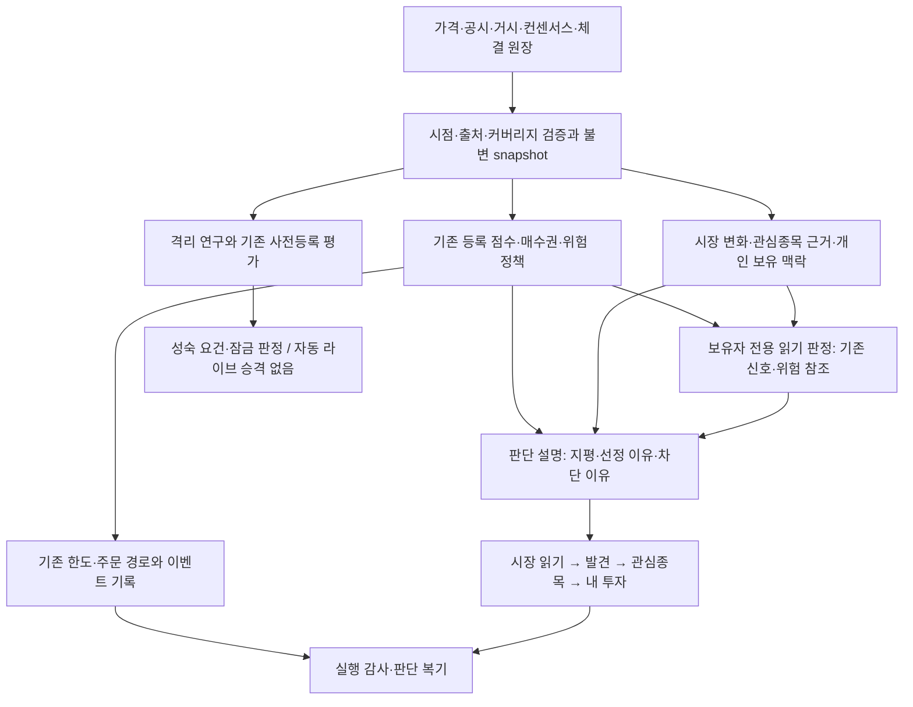

# Signal Desk 2.0 — 시장을 읽고, 근거를 추적하고, 판단에서 배우는 서비스

작성: 2026-10-03 · 코드 기준: `main@9e9d751` (#509)

상태: **설계·진단 문서. 구현·전략 변경·신규 실험 개시 승인이 아니다.**

후속 상세 설계: [소규모 검증과 ML 확장을 위한 기반 설계](SIGNAL-DESK-2.0-ENGINE-FOUNDATION-DESIGN-2026-10-03.md). 현재 엔진을 유지하면서 판단 기록·시점 계약·향후 학습과 확대 조건을 정의한다. 실제 구현은 별도 요청 후 진행한다.

## 1. 결론

Signal Desk 2.0의 목표는 **매수 신호를 더 자주 내는 서비스가 아니라, 시장의 변화와 내 투자 근거의 변화를 연결하고, 판단이 맞거나 틀린 이유를 축적하는 서비스**다.

현재 성과 부진을 “두뇌는 좋지만 매매만 잘못했다”고 결론 내릴 수 없다. 종목선정의 우위 자체가 아직 확인되지 않았다. 반대로 누적손실만으로 최근 수정까지 실패했다고 단정할 수도 없다. 과거 정책의 손실, 새 정책의 짧은 관측, 서로 다른 측정 지평이 섞여 있기 때문이다.

두 작업을 분리한다.

1. **검증 트랙:** 기존 등록 가설과 관측 일정을 지킨다. 원장·감사·데이터 품질을 개선하되 결과를 유리하게 만들지 않는다.
2. **제품 트랙:** 검증 대기 중에도 시장 이해, 관심종목 분석, 포트폴리오 맥락, 판단 복기의 가치를 제공한다. 설명의 개선을 수익 예측력 개선으로 부르지 않는다.

기존 59/100은 2026-10-02 운영 기준 그대로 둔다. 이 문서로 점수를 올리지 않는다. 기존 다섯 관문이 같은 날 열리는 완성 정의를 변경하지 않는다. 잠긴 최종 판정이 `판별력 없음`이어도 검증 체계의 완성으로 인정한다.

## 2. 변경하지 않을 경계

- 가중치·분위·손절·팩터를 변경하지 않는다. 퀄리티 가중치는 **0.15**다. 헤드라인 잠금의 정직성과 퀄리티 팩터는 다른 개념이다.
- 등록 헤드라인은 `pit-8factor-rank3-hold5-final`: PIT 상위 3%, 5거래일 보유, 비용 0.25%, 다섯 위상, 동일 시뮬레이터의 점수 라벨 대조군이다. 등록 문턱 **99.15%**와 최악 위상 조건을 유지한다.
- 2026-10-02 인계값: `pending`, 실효 **추정 12/30**, PIT **62/150**, final의 `measured_pit_dates=null`. 추정값을 실측처럼 사용하지 않는다.
- 2026-10-13 마감 전 interim을 실행하지 않는다. 기존 `prereg.run_due`가 요건을 확인한다. interim 통과도 가중 게이트 개방 근거가 아니다.
- final은 2027-02-12에 자동 합격하는 일정이 아니다. PIT 150·실효 30 등 요건이 부족하면 늦어진다. 표본이나 문턱을 낮추지 않는다.
- 탐색의 95%를 등록 문턱 대신 쓰지 않는다. 요건 전 백분위는 제품 화면에 노출하지 않는다. d4 등 다른 look을 헤드라인으로 바꾸지 않는다.
- R11–R16은 연구 전용이다. 첫 look은 비중첩 h20 **12블록**이며 실주문으로 승격하지 않는다. 연구 수익 차이를 모의투자 화면에 섞지 않는다.
- 가격 보간, 5년 `full_prices` 백필, `012510` 제외, 미국 2026-09-25 구성 되메우기, 상승장에 맞춘 추격매수 활성화를 하지 않는다.
- “매수 아님·당일 +0.5% 이상” 신규 shadow는 **미착수 제안**으로 유지한다. 이 로드맵 작성은 실행 요청이 아니다.
- 숏폼·온보딩·D7·외부 성장은 동결한다. 복수 계좌·환율 통합·개인별 세금 최적화도 이번 범위에서 제외한다.

## 3. 성과 진단: 확인된 사실과 아직 모르는 것

### 3.1 운영 화면을 다시 읽은 결과

2026-10-03에 로그인된 운영 UI를 읽기 전용으로 확인했다. 아래 계좌 수치는 **봇 모의투자**이며 실계좌 실현수익이 아니다. 국내·미국 모두 화면의 마지막 비교 기준일은 2026-10-02다. 로컬 `app.db`나 `prices.parquet`를 운영 근거로 사용하지 않았다.

| 시장·성향 | 시드 대비 수익률 | 유효 비교 창 | 같은 창의 계좌 | 같은 창의 기준선 | 차이 |
|---|---:|---|---:|---:|---:|
| 국내 안정형 | −0.67% | 09-02→10-02 | +0.47% | +2.06% | −1.59%p |
| 국내 균형형 | −6.97% | 09-02→10-02 | −0.98% | +2.06% | −3.04%p |
| 국내 공격형 | −7.16% | 09-02→10-02 | −1.18% | +2.06% | −3.24%p |
| 미국 균형형 | −0.97% | 09-29→10-02 | −0.08% | −0.13% | +0.05%p |

출처: [모의투자 운영 화면](https://signal-desk-production-fc75.up.railway.app/#trading/bot). 기준선은 화면의 PIT 동일가중 가격 기준선이며, 완전한 배당·비용 포함 투자상품과 같지 않다. 운영 화면은 이후 바뀔 수 있다.

- 국내 균형형: 시드 1,000만 원 → 평가 9,302,965원. 누적 −697,035원 중 실현 −673,776원, 평가 −23,259원이다. 비교 구간 부진을 “시장이 하락해서”로 설명할 수 없다.
- 국내 가격 공백 18쌍이 비교 시작을 제한한다. 첫 공백은 `012510`의 07-14→07-15다. 휴장 제외 및 사유 표시는 이미 반영됐다.
- 미국은 09-25 구성 정보가 없어 비교 창이 짧다. 현재 네 평가 날짜 사이의 세 수익 구간으로 미국 전략의 우월성을 판단하지 않는다. 이전 긴 미국 비교 수치는 현재 증거로 재사용하지 않는다.
- 국내 균형형 누적 거래 이벤트 217건 중 신규 51, 추가 119, 트레일링 38, 익절 5, 손절 4다. 이는 217회의 독립적인 왕복거래나 예측 실험이 아니다.
- 청산 규칙 변경 이후는 24이벤트 중 매도 **4건**뿐이다. 새 정책의 효과를 확정하기에는 짧다. “이후 매도”는 “새 정책으로 처음 진입한 포지션만”을 의미하지 않는다.
- 국내 균형형 비용 기록은 **15/217 이벤트**, 합계 5,415원이다. 미기록 비용을 0으로 보거나 이 금액으로 전체 비용 영향을 설명하지 않는다. 계좌에 반영된 비용을 분석에서 다시 차감하지도 않는다.

### 3.2 냉정한 원인 평가

| 문제 | 확인한 근거 | 현재 결론 | 필요한 조치 |
|---|---|---|---|
| 종목선정 우위 미확인 | 등록 headline pending. 관리자 h20도 오차 범위 내 | 실행 탓만 할 수 없음. 알파가 없을 가능성도 열어 둠 | 등록 표본 성숙을 기다리고 대조군·최악 위상으로 판정 |
| 질문의 지평 불일치 | 등록 h5, 관리자 h20, 봇 판단 h3, 실제 보유는 별도 | 어느 한 지평의 수치를 다른 전략의 성능으로 옮길 수 없음 | 모든 카드에 모집단·지평·정책·기준일을 표시 |
| 과거 짧은 보유와 새 정책 혼재 | 국내 균형형 청산 lot 중위 전체 0.99달력일, 변경 후 9.01달력일 | 이전 짧은 보유는 사실. 최근 충분히 개선됐다는 결론은 아직 불가 | 진입 정책별 cohort와 열린 포지션 나이까지 추적 |
| 빈번한 추가매수 가능성 | 누적 217이벤트 중 ADD 119 | 같은 정보에 반복 노출됐을 가능성. 횟수만으로 과매매나 손실 기여액 확정 불가 | 추가 시점의 새 정보·목표 비중·비용·한도 추적 |
| 순위와 확률의 혼동 | `STRONG_BUY`는 매수권 내부 순서, confidence는 점수 변환 | 강력매수라는 이름이 증거보다 강한 확신을 줄 수 있음 | 내부 enum 유지, 화면은 우선 검토·매수 후보와 조건 설명 |
| 감사의 검증 범위 부족 | 청산 이유만 `match`, 최종 설정으로 과거 틱 재생 | 실제 발동 시각·중간 상태 일치가 완전히 검증되지는 않음 | 시간순 포지션 상태 감사. 결함의 손실 기여는 별도 조사 |
| 관측·설명·매매가 느슨하게 연결 | 정성·리비전·관계·렌즈는 있으나 효과와 전달 경로가 다름 | “다 보고 계산했다” 또는 “정성은 전혀 안 본다” 모두 부정확 | 각 근거의 직접 점수/거부/간접 자문/참고 경로 표시 |

**관리자 진단용 부록 수치:** 이번 운영 조회의 h20 매수 적중률은 62.4%, 기준선 55.5%, 차이 +6.9%p ±10.3%p, 매수 85건이었다. Strong Buy 44건의 평균 +2.60%, Buy 41건의 +11.30%도 관측됐지만, 이를 등급 역전 확정이나 규칙 교체 근거로 삼지 않는다. 7,790개의 성숙 행, 62개 날짜, 12,399개 스냅샷은 독립 표본 수가 아니다. 이 숫자들은 등록 헤드라인을 대체하지 않으며 첫 화면으로 승격하지 않는다. 출처: [관리자 검증 화면](https://signal-desk-production-fc75.up.railway.app/#admin/verify).

### 3.3 코드에서 찾은 구체적인 한계

1. `signals/engine.py::apply_cross_sectional`: 원 상위 창 안에서 최소점수·게이트·커버리지를 통과한 후보만 매수권이다. 상위 종목이 막히면 공석이며 뒤 종목으로 채우지 않는다. 이는 의도된 안전장치다. 유명 기업이나 당일 급등주를 반드시 고르는 규칙은 아니다.
2. `engine.py::combine`의 confidence는 `abs(2*sigmoid(score)-1)` 변환이다. 검증된 상승확률이 아니다. `horizon.py::label`도 **과거** 5/20/60일 양의 수익 중 가장 큰 구간의 이름이지 미래 최적 보유기간이 아니다.
3. `execution_audit.py::audit_round_trip`: `match`는 실제·예상 청산 이유의 동일 여부다. 반환하는 예상·실제 청산 시각은 match에 포함되지 않는다. 최종 청산 이벤트의 risk와 평균매입가로 전체 보유 구간을 재생하므로 중간 ADD·변동성·최고가 상태 변화를 그대로 재현하는 감사가 아니다.
4. `bot.py::holding_period_stats`: 완료된 FIFO lot 중심, 중위는 lot 단위, 평균은 수량 가중이다. 거래일 비교에 5/7 근사를 사용하며 휴장·열린 포지션·진입 정책별 차이를 완전히 설명하지 못한다. 새 통계를 추가하되 과거 원자료와 등록 측정을 고쳐 쓰지 않는다.
5. `api.py`의 가격 갱신에는 `deep = full_prices or prices_need_deep_backfill()`로 이어지는 경로가 있다. 국내 공백 재조회는 이 경로와 분리해야 한다. 공백 해결 요청이 전체 5년 재수집으로 확대되면 안 된다.

위 항목은 **코드 구조에서 확인한 범위 한계**다. 이번에 실제 손실의 몇 %가 이 항목 때문인지 산출한 것은 아니다.

### 3.4 설명하면 안 되는 것

- “시그널은 검증됐고 실행만 문제다”: 미확인이다. 09-07 문서의 이런 단정은 현재 판단에 사용하지 않는다.
- “더 자주 계산하거나 상위 LLM을 쓰면 수익이 오른다”: 입력이 같으면 계산 횟수는 새 정보가 아니다.
- “12–1 모멘텀이 오늘의 최대 급등주를 못 잡았으니 잘못됐다”: 최근 21거래일을 제외하는 입력과 당일 급등 포착은 다른 과제다. 사후 최대 상승주만 보고 목적을 바꾸면 과적합이다.
- “오른 종목을 놓친 손실을 만회하자”: 놓친 상승은 계좌 확정손실이 아니다. 복구 목표 때문에 위험예산을 늘리지 않는다.
- “유명하지 않아서 나쁜 매수다”: 인지도와 기대수익은 다르다. Edison International·Delta Air Lines의 특정 매수 타당성은 당시 decision·가격·한도·근거 기록으로 평가해야 한다. 지금의 이야기로 당시 이유를 만들어내지 않는다.
- “현금이 많아서 부진했다”: 오늘의 현금 비중으로 과거 전 기간의 기여를 설명할 수 없다. 일별 노출과 수익 경로가 필요하다.

## 4. 2.0의 사용자 경험

### 4.1 다섯 화면을 하나의 판단 과정으로 연결

| 사용자 질문 | 화면 | 핵심 정보 | 지금 있는 자산 → 추가할 것 |
|---|---|---|---|
| 지금 시장에서 무엇이 달라졌지? | **시장 읽기** | 상승의 확산, 업종 상대 흐름, 새 사건, 다음 일정 | breadth·시장 국면·daily_change → 범위·지속성·원문을 묶은 변화판 |
| 어떤 기업을 더 살펴볼까? | **발견** | 현행 매수 후보 / 새로운 변화 관찰 / 오늘 움직인 종목 분리 | 정렬·매수권·why_now·리비전·관계 → 추천과 관찰의 경계 명확화 |
| 이 종목을 왜 관심에 넣었지? | **관심종목 노트** | 근거, 반증, 다음 확인, 마지막 변경점 | hypothesis·KB·event·렌즈 → 종목별 버전 있는 투자 근거 기록 |
| 나에게도 적절할까? | **내 투자** | 보유 중복·섹터 집중·현금·추가 시 위험 변화 | portfolio_intelligence·marginal·candidates → 후보 화면에 개인 맥락 연결 |
| 내 판단에서 무엇을 배웠지? | **판단 복기** | 당시 알던 사실, 나의 선택, 후속 결과, 틀린 가정 | 동결 snapshot·outcomes → 사후 설명 덧칠 없는 과정 복기 |

첫 화면의 검증 상태는 기존 **등록 하네스 헤드라인**을 유지한다. 시장 해설이나 다른 look의 좋은 숫자로 이를 밀어내지 않는다. 전문가용 연구·운영 메뉴는 별도로 접는다.

### 4.2 시장 읽기: 방향보다 구조를 설명

예시 형식(실제 운영 해설이 아니라 설계 예시): “지수는 올랐지만 추적 종목의 상승은 일부 업종에 집중됐습니다. 관심 업종은 시장보다 강했으나 전날의 강세가 이어졌는지는 아직 짧게 관측됐습니다.”

- 지수, 추적 유니버스 breadth, 업종 대비, 관심종목을 동일한 기준시각과 기간으로 연결한다. 추적 200종목을 국내 전체 시장이라고 부르지 않는다.
- 당일 변화와 여러 세션의 지속을 분리하고, 과거에 실제 보유한 구성으로만 과거 breadth를 계산한다.
- 뉴스 발표와 가격 변화의 동시 발생은 보여주되 “그 뉴스 때문에 올랐다”고 자동 단정하지 않는다.
- 국내/미국 달력·거래시간·자료 범위는 분리한다. 국내 수급과 미국 컨센서스·실적 이벤트를 동일 품질로 가정하지 않는다.
- 거시지표는 발표시각·첫 발표치·수정치·발표 전 기대치가 서로 다르다. 기대치가 없으면 서프라이즈 판정을 기권한다.

Koyfin의 [상대강도 비교](https://www.koyfin.com/help/relative-performance-relative-strength/)와 [관심종목별 뉴스 연결](https://www.koyfin.com/help/watchlist-news-feature/)을 참고한다. 기능 연결 방식의 참고이며 수익 효과의 증거는 아니다.

### 4.3 발견: 추천과 관찰을 섞지 않는다

발견 화면에는 서로 다른 세 목록이 필요하다.

1. **현행 규칙의 매수 후보:** 기존 순서·선정 규칙을 그대로 사용한다. “이유 / 탈락·공석 이유 / 검증 상태”가 같은 카드에 있다.
2. **변화를 확인할 종목:** 실적 가이던스 변경, 검증 가능한 산업 관계, 새로운 공시 등. 관찰 이유를 제공하되 매수 순위에 가산하지 않는다. R13·R15의 연구 결과와 제품 참고 정보를 분리한다.
3. **오늘 움직인 종목:** 이미 움직인 시장을 이해하는 용도다. #508의 최대 상승 카드 등을 재사용한다. 새로 발견했다는 이유만으로 추격 주문하거나 신규 shadow를 시작하지 않는다.

각 종목은 “좋은 기업인가 / 지금 진입 조건에 맞는가 / 내 보유와 맞는가”를 따로 설명한다. 이를 또 하나의 임의 합산 점수로 뭉개지 않는다.

### 4.4 관심종목: 요약문 대신 살아 있는 투자 근거

종목별로 다음 여섯 항목을 유지한다.

- 관심 이유: 매출·마진·산업 수요 등 구체적인 가정과 최초 기록시각.
- 찬성 근거: 원문·발표시각·핵심 수치. 재인용 기사 여러 개는 독립된 여러 근거가 아니다.
- 반대 근거: 가정을 깨는 사건, 이미 반영됐을 가능성, 자료 공백.
- 다음 촉매: 실적·공시·산업 지표 등 확인할 사건. 확정 일정과 추정 일정을 구분한다.
- 판단을 바꿀 조건: “좋은 뉴스가 나오면” 대신 어떤 근거가 달라지면 재검토할지 기록한다. 이 조건은 자동 주문 규칙이 아니다.
- 지난 방문 이후 변화: 새로 생긴 사실과 바뀐 해석을 구분한다. 변경이 없으면 불필요한 새 보고서를 만들지 않는다.

상태는 `관찰 중 / 근거 강화 / 반증 발생 / 자료 오래됨 / 확인 필요`처럼 행동을 이해할 수 있는 말로 표현한다. “근거 강화”는 상승확률이나 매수 승격이 아니다.

[Simply Wall St Narratives](https://support.simplywall.st/hc/en-us/articles/13416018054415-Getting-Started-with-Narratives)의 가정·위험·갱신 기록을 참고한다. 사용자 가정에 따른 가치 시나리오를 추가하더라도 검증된 목표주가처럼 표현하지 않는다. 기존 `priced_in`의 과거 상승률 기반 의심 표시를 정교한 내재 기대 분석이라고 바꾸어 부르지 않는다.

특히 “실적이 좋아졌다”와 “발표 전 기대보다 좋아졌다”와 “현재 가격에서도 매력적이다”를 다른 문장으로 다룬다. 예를 들어 이익이 증가했어도 기대치에 못 미치거나 이미 가격에 반영됐을 수 있다. 컨센서스가 없으면 기대 대비 개선이라고 말하지 않는다. 성장·마진·할인율 가정을 보여줄 수 있을 때만 조건별 가치 시나리오를 제공하고, 시나리오별 확률은 임의로 붙이지 않는다.

#### 4.4.1 이미 산 종목은 별도로 판단한다

`강력매수`는 당시 신규 진입 후보의 **상대 순위**이고, 일반 `매도`는 현행 종합점수의 별도 절대 조건이다. 주가 하락이 곧 악재 확정도, 기존 `매도`가 없다는 것이 보유 안전의 증거도 아니다. 따라서 기존 `SignalVerdict`/점수·공개 `BUY/HOLD/SELL`을 바꾸지 않고, 실제 보유자에게만 읽기 전용 `HoldingVerdict`를 제공한다. 이 층은 기존 KB의 확정 이벤트 차단·봇 위험 정책을 참조하되, 사용자 실계좌 주문이나 새 봇 청산 규칙을 만들지 않는다. 상세 계약은 [보유 후 판단 설계](SIGNAL-DESK-2.0-ENGINE-FOUNDATION-DESIGN-2026-10-03.md)에 둔다.

- 두 축을 분리한다. **하락 배경**은 `확인된 기업 사건 / 시장·업종 동반 하락 관측 / 개별 약세지만 원인 미확인 / 자료 부족`이고, **보유 행동**은 `추가매수 검토 / 유지·관찰 / 비중 축소 검토 / 청산 검토 / 판단 보류`다. 동반 하락은 인과 설명이 아니며 공시가 없다는 것만으로 `단순 조정`이라 부르지 않는다.
- 가격·평단·수량·체결/고점·시장과 업종 비교·공시/실적의 당시 가용시각·반증 조건·개인 위험 한도를 따로 제시한다. 검증 가능한 근거가 없거나 가격이 stale이면 원인과 행동을 기권하고 자료 상태를 알린다. 실계좌 체결이 미연결이면 사용자가 입력한 평단을 **미검증**으로 표시한다.
- 확인된 중대 악재는 추가매수를 막고 기존 이벤트 판단과 개인 위험을 함께 보여준다. 원인 불명의 큰 하락은 물타기 근거가 아니다. 추가매수 검토는 신규 진입 조건이 다시 유효하고, 하락 원인·추세·집중도·현금/한도 검사가 모두 통과했을 때만 제시한다. 하락률 자체를 매수 신호로 쓰지 않는다.
- 카드에는 `시장 신호 / 내 보유 위험 / 확인된 사실과 모르는 것 / 다음 확인 / 자료 기준시각`을 분리한다. 과거 현대차 사례를 설명할 때도 당시 `HOLD`·신규 매수 차단과 보유자 위험 판단을 섞거나, 매입가·체결 검증 없이 개인 손익과 `팔았어야 했다`는 사후 결론을 만들지 않는다.

### 4.5 관점 토글과 LLM

정량·산업·거시·기업 사건·내 보유 관점을 **같은 시점의 근거를 읽는 렌즈**로 제공한다. 모두 켠다고 모든 뉴스가 실시간으로 점수에 들어가거나 정확도가 높아지는 구조는 아니다.

- 현재 `lenses`의 asof·valid_until·evidence·affects 구성을 재사용한다. 데이터가 없는 관점은 “알 수 없음”이지 중립이 아니다.
- 어떤 근거가 실제 점수에 반영됐고, 어떤 것은 차단 조건·간접 자문·참고 설명인지 표시한다. 기존 advisor의 간접 영향도 숨기지 않는다.
- 기존 portfolio 렌즈는 미연결 상태이므로 보유 제약 분석 결과를 읽기 전용으로 연결한다. 새로운 배분 엔진을 중복 구현하지 않는다.
- LLM은 변화 추출, 찬반 근거 정리, 전문용어 설명을 맡는다. 계산·시간 검증·한도·주문 허가는 결정론적 코드에 둔다.
- 외부 문서는 비신뢰 입력으로 다룬다. 문서 안의 명령은 실행하지 않고 LLM에는 주문 도구나 계좌 비밀을 주지 않는다.
- 근거가 약하면 말을 길게 만드는 대신 기권한다. 여러 에이전트의 동의는 독립된 증거 수가 아니다.

### 4.6 복기와 알림: 더 많이 매매하게 만들지 않는다

학습은 별도 숏폼 콘텐츠가 아니라 **사용자가 보고 있는 종목의 판단 과정**에 넣는다.

- 거래/관찰 당시의 snapshot을 고정하고 “그때 알 수 있던 사실”과 “이후 새로 알게 된 사실”을 나란히 보여준다.
- 결과를 보기 전 저장한 근거가 없으면 “사전 판단 기록 없음”으로 남긴다. 사후에 성공 이유를 생성해 붙이지 않는다.
- 오른 종목만 골라 성공 사례로 보여주지 않는다. 지켜본 종목·기각한 종목·손실·기권을 일관된 모집단과 기간으로 복기한다. 새로운 연구 수익 비교는 기존 게이트를 우회하지 않는다.
- 초보자 설명은 “이 용어가 무엇이고 지금 판단에서 왜 필요한가”를 한 문장으로, 상세는 펼침으로 제공한다.
- Telegram은 선택 성향의 실제 이벤트 알림을 유지하면서, 관심종목의 중요한 근거 변경·반증·다가오는 확인 일정 중심으로 확장한다. 중요도·묶음·음소거·중복 방지·앱의 해당 근거로 이동을 제공한다.
- 보유자 알림은 `확인된 중대 악재 / 위험 상태의 전이 / 가격 stale로 판단 보류`처럼 행동에 영향을 주는 상태 변화만 보낸다. 종목·근거·최초 확인시각·보유 맥락·다음 확인을 담고 동일 사건의 재계산·재시작으로 반복 전송하지 않는다. 알림은 주문 버튼이나 자동 청산 명령이 아니다.
- 알림을 눌러 주문하지 않는다. 연속 접속 보상, 거래 횟수 목표, 매일 한 종목 추천 의무는 만들지 않는다.

[TradingView의 과거 구간 재생](https://www.tradingview.com/support/solutions/43000691889-learn-to-trade-on-historical-data/)에서 시간 순서대로 판단하는 방식을, [Quartr의 키워드 알림](https://quartr.com/features/keyword-alerts)에서 원문 위치로 연결하는 방식을 참고한다. 학습용 재생은 등록 성과 하네스의 재실행이 아니다.

## 5. 기술 구조: 기존 자산을 연결하고 책임을 분리

그림의 D·K·F·G는 설명/제품 계층이다. K에서 E로의 연결은 없다. 새 렌즈나 LLM 해설이 C·E의 가중치·주문 권한을 몰래 바꾸는 연결은 허용하지 않는다. 기존에 실제 영향을 주는 경로는 영향 종류와 버전을 추적한다.

### 5.1 필요한 공통 계약

| 계약 | 최소 정보 | 금지할 혼동 |
|---|---|---|
| EvidenceSnapshot | 원문 식별자, source group, 관측시각, 공개시각과 신뢰도, 유효기간, 시장 세션, 데이터 버전 | 과거 대상 날짜 = 과거에 입수 가능했던 날짜 |
| DecisionTrace | decision ID, snapshot ID, 정책 버전, 점수·선정·차단·노출 결정, 계산 지평, 만료 | 점수 갱신 = 새로운 독립 추천 |
| ThesisVersion | 종목·가정·찬반 근거 ID·반증 조건·이전 버전·변경 이유 | 사후 설명 = 사전 예측 |
| PositionStateEvent | 수량·평균가·최고가·유효 risk·결정/체결시각·비용 관측 범위 | 최종 상태 = 전 기간의 상태 |
| HoldingVerdict | 사용자·포지션 참조, 시점/정책/입력 버전, 가격·체결 신선도, 하락 배경과 보유 행동의 두 축, 근거·기권·다음 확인, 유효기간 | 신규 매수 `HOLD` = 계속 보유·추가매수 허가 또는 하락 원인 확정 |
| ReviewRecord | 원래 판단, 예정 확인시점, 결과 관측 범위, 결측, 과정 평가 | 좋은 결과 = 좋은 판단, 나쁜 결과 = 나쁜 판단 |

예측의 기간·만료를 명시하는 계약은 [QuantConnect Insight](https://www.quantconnect.com/docs/v2/writing-algorithms/algorithm-framework/alpha/key-concepts)를 참고한다. 미래수익의 크기·확률은 검증 전에는 nullable로 둔다. [FRED/ALFRED real-time period](https://fred.stlouisfed.org/docs/api/fred/realtime_period.html)는 수정된 최신 과거값과 당시 알려진 값을 구분하는 근거다. 날짜 단위 vintage만으로 장중 공개시각까지 검증됐다고 보지 않는다.

### 5.2 구조와 비용 선택

첫 단계는 기존 Python 모듈·SQLite/Parquet·작업 스케줄러·outbox를 재사용하는 **모듈 경계 정리**다. 파일 크기만을 이유로 전면 재작성하지 않는다.

- 수집/정규화, 결정론적 판단, 읽기 전용 설명, 주문/원장, 격리 연구를 인터페이스로 분리한다. 사용자 화면 요청이 수집·LLM·하네스를 연쇄 실행하지 않게 한다.
- 시세는 시장 세션에 맞춰 갱신하고, 공시·컨센서스는 실제 새 자료가 생겼을 때 처리한다. 화면 새로고침 빈도와 입력 신선도를 따로 표시한다.
- LLM은 원문 content hash와 thesis 버전으로 캐시한다. 새로운 문서 추출은 한 번 공유하고, 개인 보유 정보는 접근권한이 분리된 최소 맥락으로 처리한다.
- 대량 반복 요약은 작은 비용 경로, 중요한 상충 근거 검토만 더 큰 모델 경로로 보낸다. 사용자가 깊은 분석을 요청할 때 예상 사용 범위를 보여준다. 벤더·요금제 구매는 별도 결정이다.
- 비용 산식은 `데이터 구독 + 인프라 + 신규 원문 추출 + 변경된 근거 심층검토 + 사용자 요청 분석`으로 분리한다. 단가는 실제 토큰·캐시·청구서로 검증하며 지금의 모델 가격을 추정해 고정 예산처럼 쓰지 않는다.
- 09-27 문서의 30일 $40.93(advisor $38.80)은 당시 앱 추정치일 뿐이다. 이번 달 청구액 또는 현재 비용으로 재사용하지 않는다.
- Milvus는 시간·종목·출처 필터와 검색 품질 평가에서 기존 검색의 한계가 측정된 뒤 검토한다. 현재 `scaling_readiness`의 준비요건은 인프라 판단용이며 알파의 통계적 증거가 아니다.
- 별도 producer/queue는 적체·재시도·프로세스 분리 필요가 관측될 때 도입한다. 처음부터 Kafka나 벡터 DB가 예측력을 만든다고 가정하지 않는다.

## 6. 수익 개선은 무엇을 연구해야 하나

### 6.1 새 팩터보다 원인 분해

동일한 날짜·종목·가격 관례·비용 범위에서 다음을 순서대로 설명해야 한다.

1. **선정:** 당시 점수 상위가 동일 모집단의 대조보다 나았는가? 기존 등록 하네스로만 판정한다.
2. **배분:** 선택된 종목 중 실제로 무엇을 얼마나 보유했는가? 현금·업종·상관 노출을 사실로 집계한다.
3. **실행:** 의도한 시점·수량·가격·위험 규칙대로 움직였는가? 원장 및 시간순 상태 감사로 확인한다.
4. **비용·공백:** 관측된 수수료·스프레드·미체결·결측이 어디까지인가? 모르면 미확인으로 남긴다.

관측 원장 기여분해와 “다르게 매매했다면 벌었을 돈”은 다르다. 후자는 별도 반사실 실험이며 조기 look을 만들지 않는다. 현금·선정·타이밍 기여를 서로 다른 기준으로 계산해 합이 맞는 것처럼 보고하지 않는다.

### 6.2 기존 연구를 소화하는 순서

| 기존 연구 방향 | 검토할 경제적 이유 | 2.0에서의 위치 | 지금 하지 않을 것 |
|---|---|---|---|
| R11 비용·회전 | 작은 우위가 비용·반복 교체로 사라질 수 있음 | 원장 품질과 실행 설명 우선, 기존 연구 성숙 대기 | 수익 회복을 위한 손절·보유 규칙 즉시 변경 |
| R12 가격·퀄리티 비교 | 복잡한 조합이 단순한 대조보다 나은지 확인 | 복잡성의 증분 가치 검증 | quality 0.15 조정, 오늘 우세한 팩터로 교체 |
| R13 기대 변화·리비전 | 좋은 기업의 수준보다 기대가 바뀌는 과정이 중요할 수 있음 | 관심종목 변경 근거의 제품 가치, 전략 가치는 별도 검증 | 공개시각 없는 과거 컨센서스로 우위 주장 |
| R14 실제 계좌 전체 NAV | 보유 평가와 계좌 전체 성과는 다름 | 기존 source gate 유지 | buying power를 총현금·NAV로 간주 |
| R15 관계망 | 고객·공급사 사건의 전달이 시차를 가질 수 있음 | 공시로 확인된 관계와 영향 경로 설명 | LLM이 만든 관계를 사실로 주문 |
| R16 수급·메타 판단 | 같은 신호도 조건에 따라 결과가 다를 수 있음 | 기존 연구 관측, 표본 부족 시 기권 | 작은 조건별 표본으로 필터 최적화 |

이 방향들은 이미 구현된 연구를 더 만드는 목록이 아니라 **평가 우선순위**다. h20 비중첩 12블록은 단순 계산으로 약 240거래 세션의 길이다. 양 시장별 실제 자격·결측·블록 정의에 따라 더 늦어질 수 있다. 이들을 2027-02 headline final과 동시에 성숙한다고 약속하지 않는다.

[AQR의 거래비용 연구](https://www.aqr.com/Insights/Research/Working-Paper/Trading-Costs-of-Asset-Pricing-Anomalies)는 비용을 포함한 구현이 전략 성과에 중요함을 보여준다. 기관 거래 자료의 결과를 국내 개인 주문의 정확한 비용 계수나 수익 보장으로 옮기지는 않는다.

### 6.3 ML·AI 트레이딩에서 취할 것과 버릴 것

- [Gu·Kelly·Xiu](https://www.nber.org/papers/w25398)의 연구는 비선형 상호작용을 활용하는 ML의 가능성을 보여준다. 하지만 우리 데이터의 기간·PIT·독립 표본 부족을 모델 크기로 해결해 주지는 않는다. 시장·시점별 분리 검증과 단순 대조 우위가 먼저다.
- [Microsoft Qlib](https://github.com/microsoft/qlib)에서는 데이터·학습·예측·비용 후 평가를 식별자로 재현하는 실험 관리 방식을 차용한다. 플랫폼 전면 이관이나 대량 팩터 자동투입은 하지 않는다.
- [TradingAgents 논문](https://arxiv.org/abs/2412.20138)은 찬반 연구 역할과 구조화된 보고서 전달의 참고다. 본문의 역사적 실험은 약 3개월이며 예측당 11번의 LLM 호출과 20회 이상의 도구 호출을 설명한다. 짧은 회고적 성과를 지속 가능한 실전 알파로 받아들이지 않는다. 현재 모델로 과거 사건을 평가할 때 사전학습 지식 유입 가능성도 별도로 통제해야 한다는 것이 우리의 평가다.
- 차용 범위는 **중요한 근거 변경에 한정한 찬반 검토 + 원문 검증**이다. 매 틱·전 종목에 가상 펀드매니저 회의를 열지 않는다. 모형 간 합의 대신 출처 독립성·숫자 정확성·반증 포착을 평가한다.
- 개인 봇의 GitHub 인기, 공개 수익 스크린샷, 거래비용 없는 최적화 결과는 설계 아이디어이지 실계좌 장기 검증이 아니다. 이번 조사에서 Signal Desk가 그대로 도입해도 우월하다고 인정할 수 있는 공개 실전 기록은 확보하지 못했다.

## 7. 순차 구현 로드맵

아래 기간은 **개발 착수 후 대략적인 엔지니어링 규모 추정**이다. 검증 표본이 쌓이는 날짜와 별개이며, 배포 승인이나 일정 확약이 아니다. 동시에 진행하는 큰 작업은 최대 두 개로 제한한다.

| 순서 | 작업 | 예상 규모 | 완료 조건 | 거래 영향 |
|---|---|---|---|---|
| V20-01 | C단계 국내 가격 공백의 한정 재조회 | 2–4개발일 | 지정 종목·누락 세션만, 5년 deep 미진입, 빈 봉 사유·재시도 기록, 원본 보존 | 규칙 변경 없음. 데이터 정정은 버전 추적 |
| V20-02 | 판단 계약과 실행 감사 보강 | 4–7개발일 | 상태 변화 시간순 재생, 이유·시각 일치 분리, 감사 불가 명시, lot/정책/세션 통계 | 읽기·감사 우선. 손절값 변경 없음 |
| V20-03 | 용어·지평·검증 대기 UI 정리 | 2–4개발일 | 상대순위와 확률 구분, 과거 추세와 예측기간 구분, 예정 대기와 장애 구분 | 기존 enum·정렬·판정 유지 |
| V20-04 | 관심종목 근거 기록과 변경 요약 | 5–8개발일 | 원문 연결, 버전·반증·다음 확인, 기권, 미래 근거 유입 방지 | 참고 계층, 신규 매매 점수 없음 |
| V20-05 | 시장 읽기 → 발견 연결 | 4–7개발일 | 추적 범위·시각 표시, 상대 흐름, 후보/관찰/상승 분리 | 추격매수·신규 shadow 없음 |
| V20-06 | 내 보유 맥락·근거 변경 알림 | 4–7개발일 | 기존 제약 결과 연결, 알림 중복·권한·유효기간 검증 | 개인 분석과 알림, 주문 권한 확대 없음 |
| V20-06b | 보유 후 판단 카드·상태 변화 알림 | 7–12개발일(추정) | V20-02·04·06의 시점/원장/근거 계약 후, 사실·기권 카드부터 출시. 새 행동 문구는 별도 전진 shadow 평가 후 판단 | 읽기 전용. 기존 신호/봇/실주문 정책 불변 |
| V20-07 | 판단 복기·문맥형 학습 | 4–7개발일 | 사전 근거 보존, 승자 선택 없는 복기, 결과/과정 분리 | 성과 look·D7·온보딩으로 전용하지 않음 |

V20-01은 “다음 코드는 C단계 재조회”라는 인계를 따른다. C단계의 운영 성숙 시점(12월~1월)과 안전한 재조회 코드 준비 시점을 혼동하지 않는다. 제공자가 원래 봉을 주지 않으면 해당 날짜에 여전히 기권한다.

### 2026-10-06 우선순위 추가: 가격과 판단의 연결

사용자 요청에 따라 [기반 설계의 실시간 가격 절](SIGNAL-DESK-2.0-ENGINE-FOUNDATION-DESIGN-2026-10-03.md#실시간-가격에서-판단매매까지의-기록-설계--2026-10-06)에 P1–P6을 추가했다. 이미 구현한 V20-01을 반복하지 않고, V20-02의 남은 입력·판단·실행 연결을 우선한다. 가격 현재성은 V20-06b 보유 판단의 선행 조건이다.

| 실행 순서 | 이번에 구체화한 작업 | 선행 조건/완료의 의미 |
|---|---|---|
| P1 | 원천 시각·수신 시각·종목별 신선도·세션을 보존 | 기존 수집 기능을 확장. 실제 원천 시각을 모르면서 최신이라고 표시하지 않음 |
| P2 | 동일 입력 묶음으로 점수·순위·판단 ID 생성 | P1 이후 전체 후보군 재생. 기록 단계는 현재 계산 출력 유지 |
| P3 | 판단 유효기간과 주문 직전 시세/계좌 재확인 연결 | P2 이후 기존 주문 권한 안에서. 품질 차단의 동작 변경은 별도 버전·검증 |
| P4 | 현재가·판단 가격·기준일을 화면과 알림에 표시 | P1–P2 계약 공유, 3.0 화면에 연결. stale+갱신 실패와 복구 알림 대조 |
| P5 | 판단에 사용한 원장 보존·재생·사용량 검증 | P1–P4 구현 뒤 실제 KR/US 관측·재배포 보존 확인. TTL 삭제와 용량 측정은 별개 |
| P6 | 공급자 WebSocket·실제 분봉·장중 계산 개선 검토 | P5 결과와 이용조건 기반 채택/보류. 새 매매 주기/입력은 기존 연구와 분리 |

P1–P6은 현재 **설계 반영·신규 구현 0/6**이며 기존 2.0 데이터 확장 72%의 분모에 합치지 않는다. 3.0 각 단계의 품질 조건과 연결하되 새 문서 작성으로 완료 점수를 더하지 않는다. 데이터 확장의 DART/G.17/SEC 운영 관측과 연구 성숙 일정은 독립적으로 이어간다.

현재 전체 시세·빠른 매매 점검은 기본 5분, 보유 시세 1분, 신규 매수 검토를 포함하는 봇 루프는 30분이다. 1분 가격 수집이 1분 주문 실행을 뜻하지 않는다. 첫 구현에서는 수익을 높이기 위해 주기를 바꾸지 않고, 각 판단이 실제 어떤 가격을 사용했는지 보존한다. 이후 신규 매매 정책의 채택은 별도 평가 결과에 따른다.

### 기존 검증 달력은 별도 유지

| 시점 | 기존 단계 | 2.0 작업과의 관계 |
|---|---|---|
| 2026-10-13 마감 이후, 요건 충족 시 | A: interim 1회, 기존 목표 61 | 그전 수동 하네스 실행 없음. 통과해도 가중 닫힘 |
| 2026-11 말, 약 36번째 국내 세션 | B: buy-lift-h5-oos, 기존 목표 64 | 하네스 헤드라인 대체 금지 |
| 2026-12~2027-01 | C: 미국 창 전진·국내 원천 공백 재조회, 기존 목표 70 | 자료 회복을 강제로 보장하지 않음 |
| 2027-02-12 이후 요건 충족일 | D: final 1회 잠금, 기존 목표 90 | 있음/없음/불가를 정직하게 제시. 미충족이면 연기 |

표의 점수는 인계된 계획값이며 이번에 재채점한 결과가 아니다. 90 밖에 둔 보유 지평 문제·남은 공백을 설명 UI 개선으로 해결된 것처럼 처리하지 않는다.

### 첫 세 PR의 구체적인 범위

1. **한정 공백 복구 경로:** 관리자/일상 유지보수에서 선택된 gap pair를 bounded request로 전달. 최대 종목·기간·재시도 횟수와 backoff, 원천 인증 실패·빈 응답을 구분. `full_prices=False`여도 자동 deep으로 이어지지 않는 회귀시험. 미국 구성·등록 실행 경로는 건드리지 않는다. 수정 데이터는 새 가용시각·버전을 부여하고 이미 잠긴 결과와 당시 알던 정보는 덮어쓰지 않는다.
2. **실행 감사 정확화:** ADD·부분청산·risk 변경·최고가 상태를 시간순 복원. reason match와 trigger-time match, 주문 결정→전송→체결 지연을 분리한다. 시각 오차 허용범위는 실제 폴링·원천 정밀도에 근거해 고정하고 맞을 때까지 늘리지 않는다. 원장 공백은 전체 일치율에서 조용히 제외하지 않고 coverage로 표시한다.
3. **설명 계약/UI:** 기존 점수·kind를 변경하지 않고 초보자 문구와 지평/데이터 시각을 붙인다. `판별력 검사 N일 경과`가 예정된 no-peeking 대기를 장애로 오해하게 하지 않도록 `예정 대기 / 자료 부족 / 실제 실행 실패`를 구분한다. 대기 해소 버튼이 하네스를 조기 실행하게 해서는 안 된다.

이후 관심종목 근거 기록을 먼저 완성한다. 모든 화면을 동시에 재디자인하거나 이미 완료한 #494–#509를 다시 구현하지 않는다.

## 8. 무엇으로 2.0이 좋아졌다고 판단할까

| 영역 | 측정/검수 방법 | 잘못된 대체 지표 |
|---|---|---|
| 투자 우위 | 기존 사전등록·표본·비용·최악 위상·시장별 평가 유지 | 좋은 며칠, 행 수, 임의 백테스트 최고값 |
| 실행 신뢰 | 동일 입력의 결정 재현, 시간순 상태 감사, 비용/시세 원장 coverage | 청산 이유만 같은 match 100% |
| 보유 후 판단 | 보유 전 종목의 신선도·근거 coverage, 경고 지연·누락·오경보·기권율, 사전 고정한 비용 포함 h5/h20 비교 | 한 손실 사례에 맞춘 문턱·손절, 사후 악재 설명, 알림 건수 |
| 근거 정확성 | 주요 주장 원문 연결, 수치·시각 검증, 근거 없는 단정 차단 | LLM 문장의 자연스러움·찬성표 수 |
| 사용자 이해 | 후보 이유·기권 이유·관점 차이·내 위험·다음 확인을 설명할 수 있는지 과업 평가 | 접속 횟수·체류시간·거래 횟수 |
| 학습 | 사전 가정과 반증의 기록, 결과를 본 뒤 설명을 바꿨는지 확인 | 손실을 무조건 틀린 판단으로 채점 |
| 운영 비용 | 유용한 근거 변경당 비용, 캐시 적중, 중복 알림, 작업 지연 | 종목 수 × 무조건 LLM 호출 |

검수 항목은 새 제안이며 현재 통과했다고 주장하지 않는다. 구현 시 회귀시험에는 미래 시각의 근거 차단, 원문 수정 버전 보존, stale/null 명시, 사용자 권한 격리, 렌즈 조작 후 주문·등록 상태 불변, 재시작 중복 알림/작업 방지 등을 포함한다.

## 9. 최종 판정 이후의 분기

- **판별력 있음:** 해당 모집단·기간·비용·조건에서만 우위를 설명한다. 더 많은 금액이나 라이브 주문은 별도 실행·위험 요건 없이 자동으로 열리지 않는다.
- **판별력 없음:** 측정 실패가 아니라 가설에 대한 유효한 결과다. 검증된 추천인 것처럼 팔지 않는다. 시장 분석·관심종목·판단 복기 중심의 제품 가치는 유지하고, 다음 가설은 별도 등록·새 관측으로 다룬다.
- **판정 불가:** 가중 게이트는 계속 닫힌다. 왜 불가한지 표시한다. 이미 잠근 look을 반복 실행하지 않고, 후속 관측이 필요하면 별도 절차로 계획한다.

요약하면 **검증되지 않은 두뇌를 더 자신 있게 말하게 만드는 2.0이 아니라, 무엇을 알고 무엇을 모르는지 명확히 하고 사용자의 판단 능력을 높이는 2.0**을 만든다. 수익 개선은 그 설명과 별개로 엄격하게 입증해야 한다.

## 10. 검토 범위와 인계

- 읽은 근거: 현재 main 코드, 09-07 핸드오프, 09-27 전략 로드맵, 사전등록 설정, 측정 README, 로그인된 운영의 검증·국내/미국 모의투자·시그널 화면, 위 해외 원문.
- 기존 09-27 문서는 당시 진단 기록이다. 그 문서의 결함 목록이 전부 현재도 미해결이라고 간주하지 않는다. 이번 문서에서 현재 코드로 확인한 남은 차이만 우선순위에 올렸다.
- 이번 작업에서 하네스·신규 shadow·백필·주문·설정 변경을 실행하지 않았다. 개인 실계좌 내역이나 인증정보를 문서에 넣지 않았다.
- 운영 수치는 화면 관측이며 별도 원장 추출로 재감사한 값은 아니다. 실제 손실 기여도, 정책별 순수 OOS 성과, 현재 공급자 청구액은 추가 원천 확인이 필요하다.
- 다음 구현은 V20-01부터 진행하되, 이 문서 자체가 운영 설정 변경이나 조기 연구 실행을 허가하지 않는다.
